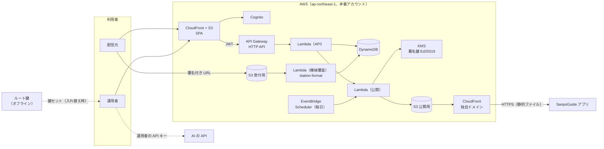

# ADR-001 チャンネル管理システムを AWS のサーバーレス構成で作り、承認済みチャンネル・リストを S3 と CloudFront で公開する

## 文書情報

| 項目 | 内容 |
|---|---|
| 文書ID | ADR-001（sanpo-channel-console） |
| ドキュメント種別 | ADR |
| 対象システム/機能 | チャンネル管理システム（SanpoGuide の第三者のチャンネルの申請・審査・承認・取り下げと、承認済みチャンネル・リストの署名・公開） |
| 関連Skill | architecture-decision-record |
| 作成日 | 2026-10-03 |
| 作成者 | Claude（開発者との検討） |
| 承認者 | 開発者（2026-10-03） |
| ステータス | 承認済 |
| 版 | 1.0 |

本書で「SanpoGuide ADR-001」「API-002」「API-003」と書くものは、SanpoGuide リポジトリの文書を指す。

## 目的・背景

SanpoGuide のアプリは、第三者が配信するチャンネルのうち、運用者が審査して署名したものだけを取り込む（[SanpoGuide ADR-001](https://github.com/duwenji/SanpoGuide/blob/main/docs/adr/ADR-001-third-party-channel-curation.md)）。審査と公開はアプリとは別の**チャンネル管理システム**で行い、アプリとの境界は承認済みチャンネル・リストの契約（[API-002](https://github.com/duwenji/SanpoGuide/blob/main/docs/channel-list-api.md)）だけにする。API-002 に準拠していれば、管理システムの実装方法と置き場所は問わない（SanpoGuide ADR-001 C-9）。

本書は、その管理システムの実装方法と置き場所を決める。開発者から次の条件が示された（2026-10-03）。

1. アプリとは別のリポジトリにする
2. AWS の API Gateway・Lambda・DynamoDB を使う
3. 画面は Single Page Application にする
4. 承認済みチャンネル・リストの URL は公開する
5. 秘密鍵で署名する

## スコープ・非スコープ

スコープ:
- リポジトリの構成
- AWS の構成（認証、API、データ、公開、署名、機械審査、定期処理、監視）
- 鍵の置き場所と使い方（ルート鍵・署名鍵・配信元の鍵）
- 配信元の鍵の移し替えの流れ（SanpoGuide ADR-001 C-11）

非スコープ（別途決める）:
- リストとパッケージの形式（API-002・API-003 で決定済み）
- 審査基準の中身（SanpoGuide の channel-review-policy.md）
- DynamoDB のキー設計の詳細（データモデルの文書で決める。[追従タスク](#影響範囲追従タスク) T-2）
- 画面の詳細設計

## 対応元ID（トレーサビリティ）

| 対応元ID | 内容 | 対応状況 |
|---|---|---|
| SanpoGuide ADR-001 | C-9（管理システム）、C-10（運用者）、C-11（配信元の鍵の移し替え）、C-12（実装） | 本書で実装方法を決める |
| API-002 | L-1〜L-5、P-1〜P-9。とくに L-3（KMS）、P-1（2 段の鍵）、P-7（静的ファイルで公開）、P-8（要約への署名）、未決事項 No.6（準拠テスト） | 本書で実装する |
| API-003 | 確認の手順 1〜10（機械で確かめる項目）、F-6（配信元の署名） | 機械審査で station-format を使う |

## 方針・決定事項

### 決定事項（2026-10-03、開発者の回答）

| No. | 論点 | 決定 |
|---|---|---|
| D-1 | 署名の大きさの制限 | KMS の Ed25519 は一度に 4,096 バイトまでしか署名できない。リストは本体の SHA-256 を含む要約に署名する（API-002 P-8）。アプリは Tink だけで確かめられる |
| D-2 | ログイン | Amazon Cognito |
| D-3 | 配信元の鍵をなくしたとき | 運用者の判断で別の鍵に移す救済策を作る（SanpoGuide ADR-001 C-11、API-002 P-9） |
| D-4 | 審査で AI に話させる見本 | 運用者の API キーで、ブラウザから AI を呼ぶ。キーはサーバーに送らない |
| D-5 | AWS アカウントとリージョン | 本番用の AWS アカウントを分ける。リージョンは ap-northeast-1 |
| D-6 | 準拠テストの置き場所 | 任意の提供元の公開 URL に対して流せるテストを、本リポジトリに置く |
| D-7 | 配信元の登録 | 誰でも登録できる（招待制にしない）。悪用への備えは A-18 |

### 構成の決定（Claude の提案を開発者が承認。2026-10-03）

| No. | 論点 | 決定案 |
|---|---|---|
| A-1 | リポジトリ | モノレポにする。`web/`（SPA）、`api/`（Lambda、TypeScript）、`validator/`（機械審査の Lambda、Kotlin）、`infra/`（AWS CDK、TypeScript）、`tools/root-key/`（ルート鍵の CLI）、`conformance/`（API-002 の準拠テスト） |
| A-2 | AWS アカウント | 開発用と本番用の 2 つ。どちらも ap-northeast-1。CloudFront の証明書だけは ACM の us-east-1 に置く（CloudFront の決まり）。開発用は別のルート鍵を持つ別の提供元にし、アプリには内蔵しない（デバッグビルドで設定から足して使う） |
| A-3 | API | API Gateway の HTTP API。Cognito の JWT で認可する。Lambda は Node.js（TypeScript）。運用者だけの操作は、JWT のグループ（`operator`）を Lambda の中でも確かめる |
| A-4 | ログイン | Cognito のユーザープールに `operator` と `publisher` のグループを作る。運用者は MFA（TOTP）を必須にし、自分で登録できない。配信元は誰でもメールアドレスで登録でき（D-7）、メールの確認を必須にする |
| A-5 | 配信元の鍵の紐づけ | 配信元のアカウントID（`sg1…`）は、管理システムが出す一度きりの文字列に配信元の鍵で署名させ、持ち主であることを確かめてから Cognito のユーザーに紐づける。配信元の秘密鍵はサーバーに送らない。パッケージへの署名（API-003 F-6）は、SPA のブラウザ内（WebCrypto の Ed25519）か CLI で行う |
| A-6 | データ | DynamoDB の 1 テーブル（ポイントインタイムリカバリを有効にする）。持つものは、配信元、チャンネル、版（申請の状態）、審査の記録、公開の記録（`seq`）、鍵セット、試用チケット、操作の記録。パッケージ・アイコンは DynamoDB に入れず S3 に置く |
| A-7 | 公開 | 公開用の S3 バケット（非公開。CloudFront の OAC からだけ読める）を、独自ドメインの CloudFront で配信する。API Gateway は通さない（API-002 P-7: 管理システムが止まってもアプリは動く）。置くものは `/.well-known/sanpo-channels`、`/v1/channels.json`、`/pkg/{sha256}.zip`、`/icons/{sha256}.png`、`/trial/{sha256}.zip`。パッケージとアイコンは中身のハッシュを名前にして `immutable` で長くキャッシュし、リストと検出の文書は短く（5 分）キャッシュする。書き込めるのは公開の Lambda だけ |
| A-8 | 署名鍵 | KMS の `ECC_NIST_EDWARDS25519`（`SIGN_VERIFY`、鍵は取り出せない）で、`ED25519_SHA_512`・`MessageType: RAW` で署名する。署名するのは、リストの要約と試用チケットだけ（どちらも 4,096 バイト未満）。`kms:Sign` を許すのは、公開の Lambda と試用チケットの Lambda のロールだけ（キーポリシーで縛る）。署名鍵は半年ごとに新しい KMS 鍵を作って入れ替え、鍵セットの有効期間（1 年以内）と重ねる |
| A-9 | ルート鍵 | `tools/root-key` の CLI で、ネットワークにつながない端末で作り、鍵セットに署名する。秘密鍵は複数の場所にオフラインで保管する。署名した鍵セットは運用者の画面から登録し、Lambda がルート鍵の公開鍵（設定に固定）で署名を確かめてから公開する |
| A-10 | 公開の処理 | 公開の Lambda は、承認・取り下げ・鍵セットの登録のときと、毎日 1 回（EventBridge Scheduler）動く。同時に 1 つしか動かないようにし（予約同時実行数 1）、`seq` は DynamoDB の条件付き書き込みで必ず増やす。本体を作り、要約を KMS で署名し、S3 に置き、CloudFront のリストと検出の文書のキャッシュを消す。毎日の作り直しで、`expiresAt`（14 日）が切れる前に必ず新しいリストを出す |
| A-11 | 機械審査 | 配信元は、署名付きの URL で受付用の S3 バケット（公開しない）にパッケージを上げる（2MB の上限を URL の条件で縛る）。上がったら、機械審査の Lambda（Java 21）が SanpoGuide の `station-format` を使って API-003 の確認の手順 1〜10 を行い、結果をエラーコードのまま DynamoDB に残す。アプリと同じコードで確かめるので、審査とアプリの判定がずれない |
| A-12 | 承認したパッケージの公開 | 承認したときに、受付用のバケットから公開用のバケットの `/pkg/{sha256}.zip` へ写す。承認前のパッケージは公開しない（試用チケットの分を除く） |
| A-13 | 試用チケット | 発行するとき、パッケージを公開用のバケットの `/trial/{sha256}.zip` に写し、7 日で消す（S3 のライフサイクル）。チケットは KMS で署名し、SPA で QR コードにして見せる |
| A-14 | 審査の見本 | 運用者の画面が、運用者の API キーでブラウザから直接 AI を呼び、API-003 のとおりにプロンプトを組み立てて場面ごとの見本を作る。キーはブラウザのメモリ（またはタブを閉じれば消える保存場所）にだけ置く。SPA の CSP で、通信先を自分の API と AI の API に限る |
| A-15 | 配信元の鍵の移し替え | 配信元が画面から新しい鍵の紐づけ（A-5 と同じ方法）と移し替えを申し出る → 運用者が、鍵とは別の経路（登録済みの連絡先など）で本人確認する → 承認すると、チャンネルの配信元が新しい鍵に変わり、移し替えを記録する。次の版から新しい鍵の署名が要り、リストには `publisherChange` を載せる（API-002 P-9）。漏れたときは、古い鍵で署名された承認待ちの版を差し戻し、必要なら公開中の版を取り下げる |
| A-16 | 監査と監視 | 状態を変える操作（申請・承認・差し戻し・取り下げ・移し替え・鍵セットの登録）は、だれが・いつ・何を・理由を DynamoDB の操作の記録に残す。KMS の署名は CloudTrail に残る。CloudWatch で、公開の失敗と、公開中のリストの `expiresAt` まで 3 日を切ったことを運用者に知らせる |
| A-18 | 登録を開くことへの備え（D-7） | ① Cognito のユーザープールに AWS WAF を付け、登録・ログインの要求を送信元ごとに回数で制限する ② API Gateway のルートごとに流量を制限する ③ 配信元ごとの上限を Lambda で守らせる（例: チャンネル 5 つ、審査待ちの版 1 チャンネルにつき 1 つ、試用チケット 1 日 10 枚。値はデータモデルで決める） ④ 運用者が配信元を停止できる（停止中は申請・試用チケットを受け付けない。公開中のチャンネルは取り下げで別に扱う） ⑤ 機械審査に落ちた版は運用者の審査待ちに入れない。配信元が鍵を紐づける（A-5）までは申請できない |
| A-17 | 配備 | AWS CDK（TypeScript）で両方のアカウントに配備する。GitHub Actions から OIDC で AWS に入る（長期のアクセスキーを持たない）。本番への配備は手動で承認する |

## 判断テーマ

1. 承認済みチャンネル・リストを、管理システムの API から出すか、静的ファイルとして出すか
2. 署名鍵をどこに置き、KMS の制限にどう合わせるか
3. 機械審査を、アプリと同じコード（Kotlin）で行うか、TypeScript で書き直すか
4. ログインと配信元の身元をどう結びつけるか

## 検討した代替案と比較軸

比較軸: アプリへの影響（API-002 の変更の大きさ）、鍵の安全性、審査とアプリの判定の一致、運用の手間、費用

| 案 | 比較軸 | 評価 |
|---|---|---|
| 公開 1. API Gateway と Lambda でリストを返す | 管理システムが止まるとアプリが取得できない（P-7 に反する）。呼ばれるたびに費用がかかる | 不採用 |
| 公開 2. S3 と CloudFront で静的ファイルとして出す | P-7 のとおり。費用はほぼ配信量だけ | **採用（A-7）** |
| 署名 A. KMS の Ed25519ph で本体に署名 | 文書の形は変わらない。ただしアプリが使う Tink は Ed25519ph に対応せず、BouncyCastle を足す必要がある | 不採用（D-1） |
| 署名 B'. 要約に通常の Ed25519 で署名 | 鍵は KMS から出ない。アプリは Tink だけでよい。API-002 の文書の形に要約が 1 つ増える | **採用（D-1）** |
| 署名 C. 秘密鍵を KMS で暗号化して保管し、Lambda で署名 | 契約は変わらない。秘密鍵が Lambda のメモリに出る（API-002 L-3 の趣旨に反する） | 不採用 |
| 審査 1. 機械審査を TypeScript で書き直す | Lambda の言語が揃う。アプリと判定がずれるおそれがあり、形式の変更のたびに 2 か所を直す | 不採用 |
| 審査 2. `station-format`（Kotlin）を Java の Lambda で使う | アプリと同じコード。Lambda の言語が 2 つになり、起動が遅い（審査は非同期なので問題にならない） | **採用（A-11）** |
| ログイン 1. 配信元の鍵だけで入る（署名でログイン） | パスワードが要らない。鍵をなくすとログインもできず、移し替え（D-3）の本人確認ができない | 不採用 |
| ログイン 2. Cognito ＋ 鍵の紐づけ | 鍵をなくしてもログインできる。運用者に MFA を強制できる | **採用（D-2・A-4・A-5）** |
| データ: DynamoDB / RDS | 開発者の条件で DynamoDB。件数が少なく、取り出し方が決まっているので足りる | DynamoDB（条件） |

## 採用案と採否理由

上の採用案を組み合わせる。

- アプリから見えるのは、CloudFront の上の静的ファイルだけになる。管理システムの API・画面・データベースが止まっても、アプリはリストの期限まで動く（API-002 P-7）
- リストに署名する秘密鍵は KMS から出ない。乗っ取られても、ルート鍵で署名鍵を失効させれば立て直せる（API-002 P-1）。要約への署名で KMS の制限を避け、アプリには新しいライブラリが要らない
- 機械審査はアプリと同じコードなので、「審査に通ったのにアプリが拒む」ことが起きにくい
- 鍵をなくした配信元も、Cognito のアカウントで本人確認の入口に立てる

却下した案の理由は、上の比較表のとおり。

## 影響範囲・追従タスク

| 観点 | 影響 |
|---|---|
| 実装 | 本リポジトリを新しく作る。SanpoGuide 側は API-002 1.1（要約への署名、`publisherChange`）をアプリに実装する。`station-format` を本リポジトリから使えるように公開する |
| 運用 | 運用者の仕事: ルート鍵の保管、署名鍵の半年ごとの入れ替え、審査、取り下げ、鍵の移し替えの本人確認、AWS の費用と通知の確認 |
| テスト | `conformance/` の準拠テスト（API-002 V-01〜V-09・V-15・V-16）を、開発用と本番用の提供元に対して CI で流す。公開の Lambda は、`seq` の単調増加、同時実行、要約と本体の一致をテストする |
| 移行 | 新しいシステムなので、既存のデータの移行はない |
| 保守 | API-002・API-003 の版が上がったら、`station-format` の版を上げ、準拠テストを直す |
| セキュリティ | 運用者のアカウントの乗っ取りが最大のリスク（偽の承認ができる）。MFA の必須化、操作の記録、承認の通知で備える |
| 費用 | 利用者が少ないうちは、ほぼ無料枠の範囲。KMS の鍵は 1 つあたり月 1 USD で、入れ替えの重なりの間は 2 つ。WAF は Web ACL とルールで月数 USD かかる |

| ID | 追従タスク | 担当 | 時期 |
|---|---|---|---|
| T-1 | SanpoGuide の API-002 1.1・ADR-001 1.1 の承認 | 開発者 | 本書の承認と同時 |
| T-2 | データモデル（DynamoDB のキー設計、版の状態遷移） | 開発者・Claude | 実装の前 |
| T-3 | 管理システムの API の契約書（SPA と Lambda の間） | 開発者・Claude | T-2 の後 |
| T-4 | `station-format` の公開方法を決めて公開する（GitHub Packages、または git のサブモジュール） | 開発者・Claude | 機械審査の実装の前 |
| T-5 | ルート鍵と署名鍵の手順書（作成・保管・入れ替え・失効。SanpoGuide ADR-001 T-3） | 開発者 | 本番の提供元を公開する前 |
| T-6 | 実装の順番: ① CDK の土台・公開の Lambda・ルート鍵の CLI・準拠テスト → ② 運用者の画面（審査・承認・取り下げ） → ③ 配信元の画面（申請・試用チケット・鍵の移し替え） | Claude | T-2〜T-5 の後 |
| T-7 | 独自ドメインを決める | 開発者 | 本番の配備の前 |

見直しの条件:
- 運用者が複数になったとき（承認を 2 人にする、権限を分ける）
- 申請が増えて、審査の見本を作る AI の費用や手間が問題になったとき（サーバー側で作る、など）
- AWS KMS の制限が変わったとき、または API-002 の署名の形が変わったとき
- 配信元から、画面ではなく API（CI からの申請など）を求められたとき
- 登録や申請の悪用で、審査待ちや費用（WAF・Cognito）が問題になったとき（招待制や審査付きの登録に切り替える）

## 制約

- KMS の Ed25519 で一度に署名できるのは 4,096 バイトまで。要約の大きさはこれを超えないこと（API-002 V-15）
- CloudFront の証明書は us-east-1 の ACM に置く必要がある
- ブラウザから AI を直接呼べるかは、AI のサービスごとに違う（CORS の対応）。対応しないサービスは見本の作成に使えない
- 公開用のバケットに置いた試用のパッケージは、URL を知っていれば誰でも取得できる（名前はパッケージの SHA-256 なので推測しにくいが、秘密ではない）

## 未決事項・リスク

| No. | 内容 | 決める時期 |
|---|---|---|
| 1 | ~~配信元の登録を誰でもできるようにするか、運用者の招待だけにするか~~ → 解決（2026-10-03、D-7: 誰でも登録できる。備えは A-18） | — |
| 2 | 独自ドメイン（T-7） | 本番の配備の前 |
| 3 | 配信元向けの API（CI からの申請など）を用意するか（SanpoGuide TODO.md の「決めること」） | 配信元の画面の後 |
| 4 | 審査を無料にするか有料にするか（SanpoGuide ADR-001 の未決事項 No.3） | 第三者のチャンネルの公開の前 |
| 5 | 見本の作成に使う AI のサービスのうち、ブラウザから呼べるもの（審査基準 2.7 は 2 つ以上で試すことを求める） | 運用者の画面の実装時 |
| 6 | 鍵の移し替えの本人確認で、何を「鍵とは別の経路」とするか（登録済みの連絡先、配信元のウェブサイトなど） | T-3 |

## 関連ドキュメント・参照リンク

- SanpoGuide [ADR-001](https://github.com/duwenji/SanpoGuide/blob/main/docs/adr/ADR-001-third-party-channel-curation.md): 第三者のチャンネルは運用者の審査と署名を経たものだけ取り込む
- SanpoGuide [API-002](https://github.com/duwenji/SanpoGuide/blob/main/docs/channel-list-api.md): 承認済みチャンネル・リスト
- SanpoGuide [API-003](https://github.com/duwenji/SanpoGuide/blob/main/docs/channel-package-format.md): チャンネル・パッケージの形式
- SanpoGuide [channel-review-policy.md](https://github.com/duwenji/SanpoGuide/blob/main/docs/channel-review-policy.md): 審査基準（草案）
- [AWS KMS Sign API](https://docs.aws.amazon.com/kms/latest/APIReference/API_Sign.html): 署名できる大きさ（4,096 バイト）と Ed25519
- 検討の記録: [skill-logs/adr_2026-10-03.md](../skill-logs/adr_2026-10-03.md)

## 変更履歴

| 日付 | 版 | 変更内容 | 変更者 |
|---|---|---|---|
| 2026-10-03 | 0.1 | 草案（D-1〜D-6 は開発者の決定、A-1〜A-17 は提案） | Claude |
| 2026-10-03 | 1.0 | A-1〜A-17 を承認。D-7（配信元の登録は誰でもできる）と A-18（その備え）を追加し、未決事項 No.1 を解消 | Claude（承認: 開発者） |
