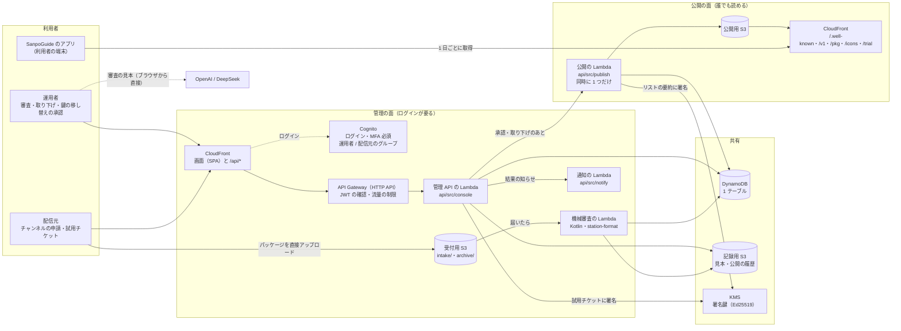
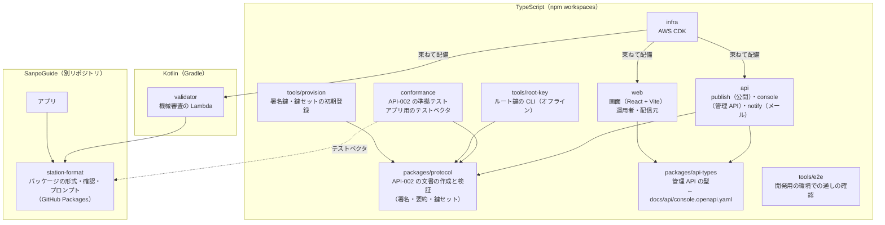
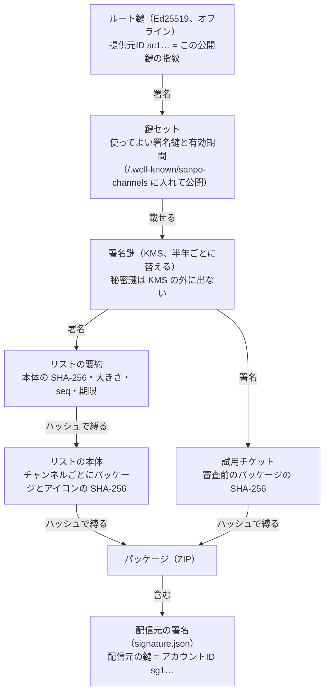
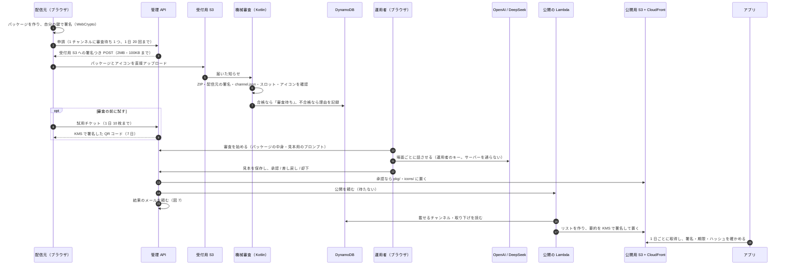
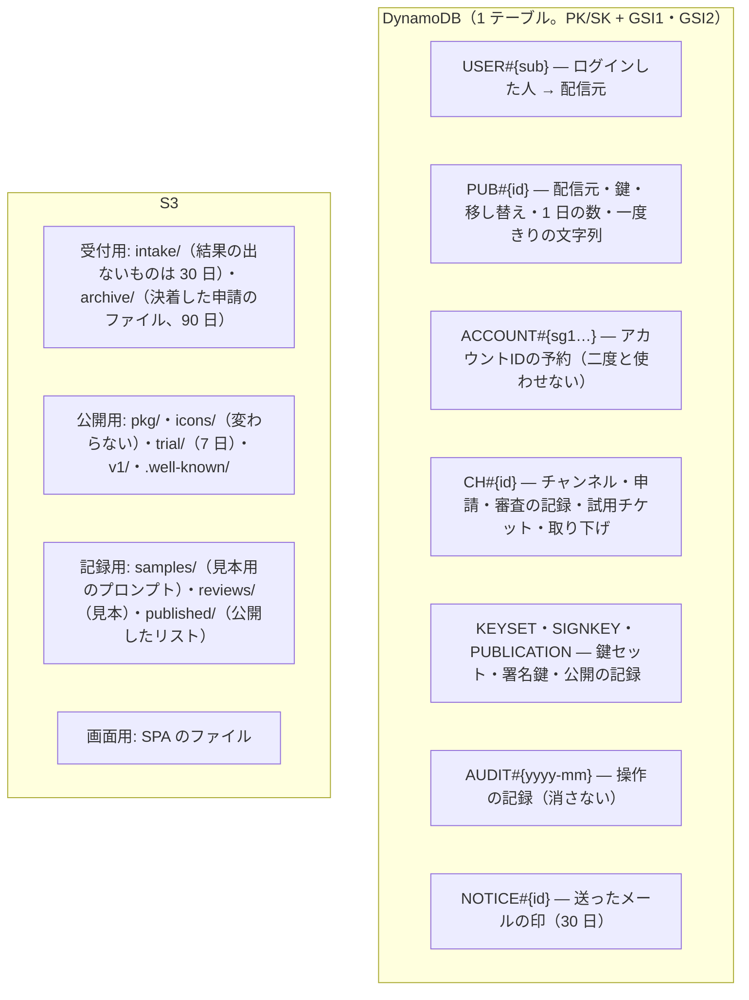
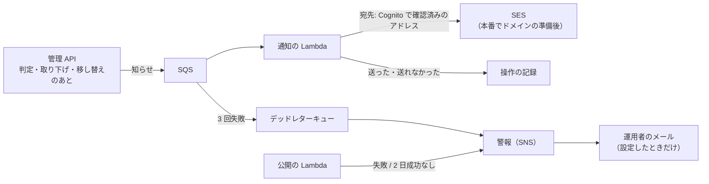

# チャンネル管理システムの構成図

sanpo-channel-console を 8 枚の図で説明する。図 1 で「誰が何を使い、どこに何があるか」をつかみ、図 2〜3 でリポジトリと信頼の仕組み、図 4〜8 で申請から公開まで・公開の処理・データの置き場所・メールと警報・環境を追う。

- 何をするシステムか: SanpoGuide のアプリに第三者のチャンネルを届けるため、配信元の申請を審査し、承認したものだけを署名したリスト（承認済みチャンネル・リスト）で公開する
- アプリとの境界は SanpoGuide の [API-002](https://github.com/duwenji/SanpoGuide/blob/main/docs/channel-list-api.md) だけ。アプリはこのシステムの API を呼ばず、公開された静的ファイルを取りに来る
- 規模（2026-10-04）: ソース 65 ファイル・約 7,750 行（TypeScript と Kotlin。テスト・生成した型・e2e を除く）、テスト 13 ファイル・約 1,970 行。Lambda 5 つ、画面 1 つ（運用者と配信元で共用）、管理 API 48 操作、DynamoDB のテーブル 1 つ、S3 のバケット 4 つ

**手で配置した図・凡例・コードから確かめた細部つきの版は [architecture.html](architecture.html)**（ブラウザで開く）。この Markdown 版は GitHub の上で読むためのもので、同じ構成を Mermaid で描いている。

図はコードと CDK から手で書き起こしたもの。Lambda・バケット・項目の種類を足したり変えたりしたときは、この文書と architecture.html の両方を更新する。設計の理由は [ADR-001](adr/ADR-001-aws-architecture.md)、データの細部は [DM-001](data-model.md)、API は [API-001](console-api.md) を見る。

## 図 1 · 全体: 3 種類の利用者と、AWS の上の 2 つの面

管理システムには 2 つの面がある。運用者と配信元が使う **管理の面**（ログインが要る画面と API）と、アプリが取りに来る **公開の面**（誰でも読める静的ファイル）。2 つの面をつなぐのは DynamoDB と、公開の Lambda だけ。

- **運用者** は、審査（機械の結果・パッケージの中身・AI に話させた見本）・承認・差し戻し・却下・取り下げ・配信元の停止・鍵の移し替えの承認・鍵セットの登録をする。審査の見本は、運用者のブラウザから運用者のキーで AI を呼んで作る（キーはサーバーに送らない）
- **配信元** は、登録・鍵の紐づけ・チャンネルの登録・申請・試用チケットの発行・鍵の移し替えの申し出をする。秘密鍵はブラウザの中で作り、サーバーに送らない
- **アプリ** は公開の面だけを読む。リストの署名・期限・パッケージのハッシュをアプリ自身が確かめるので、CloudFront や S3 を信用する必要はない

## 図 2 · リポジトリ: npm workspaces と、SanpoGuide から借りる station-format

- 管理 API の契約は `docs/api/console.openapi.yaml` が元で、`packages/api-types` の型を API と画面の両方が使う
- 機械審査は、アプリと同じ `station-format` で確かめる（審査とアプリの判定をずらさない）。`conformance` の `app-vectors.ts` が作った署名つきの文書で、アプリ側の確認（`ProviderDocuments`）をテストしている

## 図 3 · 信頼の鎖: アプリはルート鍵だけを知っていればよい

- KMS は 4,096 バイトまでしか署名できないので、リストは本体ではなく要約に署名する（API-002 P-8）
- ルート鍵はリポジトリにも AWS にも置かない。開発用のルート鍵は開発者の端末の `~/.sanpo-channel-console/dev/`、本番のルート鍵はオフラインの端末で作る（T-5）
- 配信元の鍵は配信元のブラウザの中だけ。なくしたときは、運用者の本人確認を経て新しい鍵に移す（図 4 の下）

## 図 4 · 申請から公開まで

- 差し戻し・却下には、審査基準の項目番号つきの指摘が必須。配信元の画面とメールに出る
- **取り下げ**: 運用者が理由を付けて取り下げると、リストの `revoked` に 7 日載り、アプリは端末から消して理由を知らせる
- **鍵の移し替え**: 配信元が新しい鍵を作って申し出て、運用者が鍵とは別の経路で本人確認してから承認する。すべてのチャンネルが新しい鍵に移り、古い鍵の審査待ちの申請は差し戻される。新しい鍵の最初の版が承認されると、リストに `publisherChange` が 90 日載る

## 図 5 · 公開の Lambda: 何度呼ばれても、作るリストは 1 つずつ

```mermaid
flowchart LR
  subgraph TRIGGERS["きっかけ"]
    t1["承認"]
    t2["取り下げ"]
    t3["鍵の移し替え"]
    t4["鍵セットの登録"]
    t5["手動（運用者の画面）"]
    t6["毎日 03:00 JST<br/>（EventBridge Scheduler）"]
  end
  TRIGGERS --> PF["公開の Lambda<br/>同時実行 1"]
  PF --> R1["DynamoDB から読む<br/>載せるチャンネル（GSI2 LISTED）<br/>7 日以内の取り下げ（GSI2 REVOKED）<br/>鍵セットの先頭"]
  R1 --> B["リストの本体を作る<br/>seq = 前回 + 1、期限 14 日"]
  B --> S["要約を作り、使える署名鍵で署名<br/>（鍵セットに載っていて期間内）"]
  S --> W["公開用 S3 に置く<br/>/v1/channels.json<br/>/.well-known/sanpo-channels"]
  W --> I["CloudFront の無効化"]
  I --> H["DynamoDB に公開の記録<br/>（seq を条件に書く）<br/>記録用 S3 に published/{seq}.json"]
```

- 内容が変わらなくても毎日作り直す。リストは 14 日で切れるので、毎日の公開が 2 日止まると警報が出る（図 7）
- `seq` を条件に書くので、2 つの公開が重なっても `seq` が飛んだり戻ったりしない。古い `seq` のリストはアプリが拒む

## 図 6 · データの置き場所

- 状態を変える書き込みは、操作の記録と同じトランザクションで書く。変更には `If-Match`（`rev`）が要る
- GSI1 は「持ち主ごとの一覧」と「対象ごとの操作の記録」、GSI2 は疎なインデックスで「審査待ち」「リストに載せるもの」「取り下げ」「移し替え待ち」「配信元の一覧」
- 項目と属性の一覧は [DM-001](data-model.md)

## 図 7 · メールと警報

- メールが送れなくても操作は成功させる。開発用はドメインがないので送らず、送る内容を記録するだけ
- 警報は 3 つ: 公開の失敗、2 日間公開が成功していない、メールが送れずデッドレターキューに入った

## 図 8 · 環境と費用

| | 開発用（dev） | 本番（prod） |
|---|---|---|
| AWS アカウント | 開発用（ap-northeast-1） | 本番用に分ける（未作成） |
| ルート鍵 | 開発者の端末（`~/.sanpo-channel-console/dev/`） | オフラインの端末（T-5 の手順） |
| 一覧のカーソルの鍵 | 配備のたびに作る（環境変数） | Secrets Manager |
| WAF（Cognito） | なし | あり |
| DynamoDB のポイントインタイムリカバリ | なし | あり |
| ログの保持 | 14 日 | 期限なし |
| メール | 記録だけ（`notify: log`） | ドメイン（T-7）と SES の準備（T-8）のあと `ses` |
| 費用の上限の通知 | 月 5 USD | — |
| アプリへの内蔵 | しない（利用者が URL と提供元IDで足す） | 内蔵する提供元 |

配備の手順は [docs/operations/deploy.md](operations/deploy.md)、費用は [docs/operations/cost.md](operations/cost.md)。

## 関連する文書

- 使い方: [利用ガイド](guide/README.md)（運用者・配信元・開発と保守）
- 設計の決定: [ADR-001](adr/ADR-001-aws-architecture.md)、データ: [DM-001](data-model.md)、管理 API: [API-001](console-api.md)
- 実装ごとの設計: [DES-001](design/DES-001-publisher.md)（公開）〜 [DES-006](design/DES-006-transfer-notify.md)（鍵の移し替えとメール）
- アプリとの境界: SanpoGuide の [API-002](https://github.com/duwenji/SanpoGuide/blob/main/docs/channel-list-api.md)（リスト）・[API-003](https://github.com/duwenji/SanpoGuide/blob/main/docs/channel-package-format.md)（パッケージ）
