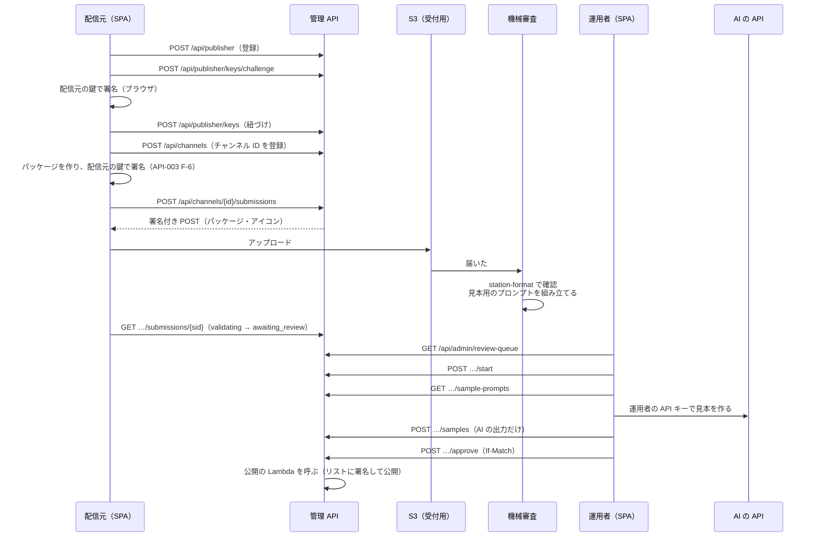

# チャンネル管理システム 管理 API 契約書

## 文書情報

| 項目 | 内容 |
|---|---|
| 文書ID | API-001（sanpo-channel-console） |
| ドキュメント種別 | API契約書 |
| 対象システム/機能 | チャンネル管理システムの管理 API（SPA と Lambda の間。API Gateway の HTTP API と Cognito） |
| 関連Skill | 020_api-contract-design |
| 作成日 | 2026-10-03 |
| 作成者 | Claude（開発者との検討） |
| 承認者 | 開発者（2026-10-03） |
| ステータス | 承認済 |
| 版 | 1.0 |

入出力の正本は [api/console.openapi.yaml](api/console.openapi.yaml)。本書は方針・状態・エラー・権限を説明し、食い違いがあれば本書に合わせて OpenAPI を直す。

## 目的・背景

[ADR-001](adr/ADR-001-aws-architecture.md) で管理システムの構成を、[DM-001](data-model.md) でデータを決めた。本書は、配信元と運用者が SPA から使う API を決める（ADR-001 T-3）。

この API の利用者は、同じリポジトリの SPA（`web/`）だけ。アプリ（SanpoGuide）はこの API を使わない。アプリが使うのは、公開用の静的ファイル（SanpoGuide の API-002）だけである。

## スコープ・非スコープ

スコープ:
- 配信元: 登録・退会、鍵の紐づけ、鍵の移し替えの申し出、チャンネルの登録、申請（アップロード）・取り消し、試用チケット、審査の結果と経緯の確認
- 運用者: 審査（パッケージ・見本用のプロンプトの取得、見本の保存、判定）、取り下げ、配信元の停止・上限、鍵の移し替えの承認、鍵セット・署名鍵の登録、公開の履歴と手動の公開、操作の記録
- 認証・権限、エラー、同時の書き込み、一覧の続き、上限

非スコープ:
- 公開用の静的ファイル（SanpoGuide の API-002）
- Lambda の内部の呼び出し（機械審査・公開。ADR-001 A-10・A-11）
- 通知のメールの文面（実装時に決める。送る出来事と宛先は C-14）

## 対応元ID（トレーサビリティ）

| 対応元ID | 内容 | 対応状況 |
|---|---|---|
| ADR-001 | A-3（HTTP API・JWT）、A-4（Cognito のグループ）、A-5（鍵の紐づけ）、A-11〜A-15、A-18（上限・停止）、D-4（見本はブラウザから） | 本書で API にする |
| DM-001 | AP-01〜AP-22、状態の移り方、M-2（上限）、M-5（版の番号）、M-11（`rev`） | 本書の操作の対応先。1.1 の改訂案あり（[DM-001 への影響](#dm-001-への影響)） |
| SanpoGuide API-002 | `channels[]` の項目（`description`・`tags`・`regions`・`icon`）、試用チケット、鍵セット | 申請の入力・試用チケット・鍵セットの登録 |
| SanpoGuide API-003 | エラーコード、配信元の署名 | 機械審査の結果をそのまま返す |

## 方針・決定事項

### 決定事項（2026-10-03、開発者の回答）

| No. | 論点 | 決定 |
|---|---|---|
| C-1 | 見本用のプロンプトを組み立てる場所 | SanpoGuide の `PromptTemplates` とプロンプトのファイルを `station-format` に移し、機械審査の Lambda が場面ごとのプロンプトを組み立てる。SPA はそれを AI に送るだけ。アプリと同じ組み立て方になる |
| C-2 | エラーの形 | RFC 9457（`application/problem+json`）に `code` を足す。SanpoGuide の API-001 と同じ |
| C-3 | 契約の正本 | 本書と OpenAPI 3.1。SPA と Lambda の型は OpenAPI から作る |
| C-4 | 配信元の退会 | 配信元が自分で退会できる。公開中のチャンネルはすべて取り下げ、Cognito のユーザーと連絡先を消す。操作の記録、アカウントIDの予約、チャンネルIDは残す（再利用させない） |
| C-14 | 配信元への通知 | 判定（承認・差し戻し・却下）、取り下げ、鍵の移し替えの結果（承認・認めない）を、配信元にメールで知らせる。送るのは Amazon SES（ADR-001 A-19）。宛先は Cognito で確認済みのメールアドレス（`contact` ではない）。本文には理由と画面へのリンクだけを入れ、見本・運用者の `sub` は入れない。メールが送れなくても操作は成功させ、送信の結果は操作の記録に残す |

### 設計の決定（Claude の提案を開発者が承認。2026-10-03）

| No. | 論点 | 決定案 |
|---|---|---|
| C-5 | 置き場所 | SPA と同じ CloudFront の `/api/*` を API Gateway に送る。同じオリジンなので CORS が要らない |
| C-6 | 形 | リソースに対する REST。状態を変える操作は `POST …/{動詞}`（例: `/approve`）。版の番号を URL に入れない（SPA と API は一緒に配備する） |
| C-7 | 認証 | `Authorization: Bearer {Cognito のアクセストークン}`。API Gateway の JWT オーソライザーで確かめ、Lambda でグループ（`cognito:groups`）を確かめる。`/api/admin/*` は `operator` だけ |
| C-8 | 同時の書き込み | 状態が変わるもの（配信元・チャンネル・申請・鍵の移し替え）は、応答に `ETag`（DM-001 の `rev`）を付ける。それを変える操作は `If-Match` が必須で、ないと 428、違うと 412 |
| C-9 | 一覧の続き | `?cursor=…&limit=…`。応答の `nextCursor` は中身の読めない文字列（DynamoDB の続きの位置を暗号化したもの）。`limit` は 1〜100、既定は 20 |
| C-10 | アップロード | 申請を作ると、パッケージ（2MB まで）とアイコン（100KB まで）の S3 の署名付き POST を返す。大きさの上限は S3 が強制する。有効期限は 15 分。1 時間届かなければ申請は `expired` |
| C-11 | 鍵の移し替えの単位 | 配信元ごとにする（DM-001 ではチャンネルごと）。配信元が使う鍵は 1 つなので、すべてのチャンネルが一緒に移る。DM-001 を 1.1 に改める |
| C-12 | 運用者が見られる範囲 | 運用者は `/api/admin/*` のほか、配信元向けの読み取りの操作（`GET /api/channels/{channelId}` など）も、どの配信元のものでも呼べる |
| C-13 | 秘密を送らない | AI の API キー、配信元の秘密鍵は、どの操作にも含めない。見本は AI の出力だけを保存する |

### 全体の流れ



## エンドポイント一覧

権限: P = 配信元（`publisher` のグループで、自分のもの）、O = 運用者（`operator`）、本人 = ログインしていれば誰でも

### 配信元

| メソッド | パス | 権限 | 概要 | DM-001 |
|---|---|---|---|---|
| GET | `/api/me` | 本人 | ログインしているユーザー、役割、配信元 | AP-01 |
| POST | `/api/publisher` | 本人 | 配信元として登録（`pending_key`） | — |
| GET | `/api/publisher` | P | 自分の配信元 | AP-02 |
| PATCH | `/api/publisher` | P | 表示名・連絡先の変更（If-Match） | — |
| DELETE | `/api/publisher` | P | 退会（If-Match）。C-4 | — |
| POST | `/api/publisher/keys/challenge` | P | 鍵の紐づけ用の一度きりの文字列 | AP-22 |
| POST | `/api/publisher/keys` | P | 最初の鍵を紐づける | AP-04 |
| GET | `/api/publisher/keys` | P | 鍵の一覧（今のものと過去のもの） | AP-03 |
| POST | `/api/publisher/key-transfers` | P | 新しい鍵を紐づけて、移し替えを申し出る | — |
| GET | `/api/publisher/key-transfers` | P | 移し替えの申し出の一覧 | — |
| POST | `/api/publisher/key-transfers/{transferId}/cancel` | P | 申し出を取り消す（If-Match） | — |
| GET | `/api/publisher/history` | P | 自分の配信元・チャンネルの経緯（操作の記録のうち配信元に見せるもの） | AP-19 |
| POST | `/api/channels` | P | チャンネル ID を登録 | — |
| GET | `/api/channels` | P | 自分のチャンネルの一覧 | AP-05 |
| GET | `/api/channels/{channelId}` | P・O | チャンネル | AP-06 |
| POST | `/api/channels/{channelId}/submissions` | P | 申請を作り、アップロード先を受け取る | AP-17 |
| GET | `/api/channels/{channelId}/submissions` | P・O | 申請の一覧（新しい順） | AP-07 |
| GET | `/api/channels/{channelId}/submissions/{submissionId}` | P・O | 申請（機械審査の結果、判定と理由） | AP-07・08 |
| POST | `/api/channels/{channelId}/submissions/{submissionId}/withdraw` | P | 申請を取り消す（If-Match） | — |
| POST | `/api/channels/{channelId}/submissions/{submissionId}/test-tickets` | P | 試用チケットを発行 | AP-16・17 |
| GET | `/api/channels/{channelId}/submissions/{submissionId}/test-tickets` | P | 試用チケットの一覧 | AP-16 |

### 運用者

| メソッド | パス | 概要 | DM-001 |
|---|---|---|---|
| GET | `/api/admin/review-queue` | 審査待ち（古い順） | AP-09 |
| GET | `/api/admin/channels/{channelId}/submissions/{submissionId}/package` | パッケージ・アイコンの取得先（署名付き URL、5 分） | — |
| GET | `/api/admin/channels/{channelId}/submissions/{submissionId}/sample-prompts` | 見本用のプロンプト（場面ごと） | — |
| POST | `/api/admin/channels/{channelId}/submissions/{submissionId}/samples` | AI に話させた見本を保存 | — |
| GET | `/api/admin/channels/{channelId}/submissions/{submissionId}/reviews` | 審査の記録（見本を含む） | AP-08 |
| POST | `/api/admin/channels/{channelId}/submissions/{submissionId}/start` | 審査を始める（If-Match） | — |
| POST | `/api/admin/channels/{channelId}/submissions/{submissionId}/release` | 審査を戻す（If-Match） | — |
| POST | `/api/admin/channels/{channelId}/submissions/{submissionId}/approve` | 承認（If-Match） | — |
| POST | `/api/admin/channels/{channelId}/submissions/{submissionId}/return` | 差し戻し（If-Match） | — |
| POST | `/api/admin/channels/{channelId}/submissions/{submissionId}/reject` | 却下（If-Match） | — |
| POST | `/api/admin/channels/{channelId}/revoke` | 取り下げ（If-Match） | AP-11 |
| GET | `/api/admin/publishers` | 配信元の一覧（`?status=`） | AP-20 |
| GET | `/api/admin/publishers/{publisherId}` | 配信元 | AP-02 |
| GET | `/api/admin/publishers/{publisherId}/channels` | 配信元のチャンネル | AP-05 |
| POST | `/api/admin/publishers/{publisherId}/suspend` | 停止（If-Match） | — |
| POST | `/api/admin/publishers/{publisherId}/resume` | 停止を解く（If-Match） | — |
| PUT | `/api/admin/publishers/{publisherId}/limits` | 上限を変える（If-Match） | — |
| GET | `/api/admin/key-transfers` | 移し替えの申し出（`?state=requested`） | AP-12 |
| POST | `/api/admin/publishers/{publisherId}/key-transfers/{transferId}/approve` | 移し替えを承認（If-Match） | — |
| POST | `/api/admin/publishers/{publisherId}/key-transfers/{transferId}/reject` | 移し替えを認めない（If-Match） | — |
| GET | `/api/admin/signing-keys` | 署名鍵の一覧 | AP-15 |
| POST | `/api/admin/signing-keys` | KMS の鍵を署名鍵として登録 | — |
| GET | `/api/admin/keysets` | 鍵セットの履歴 | AP-15 |
| POST | `/api/admin/keysets` | ルート鍵が署名した鍵セットを登録 | AP-15 |
| GET | `/api/admin/publications` | 公開の履歴 | AP-14 |
| POST | `/api/admin/publications` | 今すぐ作り直して公開する | AP-13 |
| GET | `/api/admin/audit` | 操作の記録（`?month=` または `?target=`） | AP-18・19 |

## リクエスト・レスポンス仕様

項目の詳細は OpenAPI。ここでは判断が要るところだけを書く。

共通の決まり:
- 文字コードは UTF-8、日時は UTC の ISO 8601（ミリ秒まで）、ID は ULID（チャンネル ID は API-002 の書式）
- 知らない項目は無視する。応答への項目の追加は互換性のある変更
- 状態が変わるものの応答には、本文の `rev` と同じ値の `ETag`（`"{rev}"`）を付ける

### POST /api/publisher/keys/challenge → POST /api/publisher/keys

```json
// 応答（challenge）
{ "nonce": "01J…", "message": "sanpo-channel-console:bind-key:01J…:{publisherId}", "expiresAt": "…" }
// 要求（keys）
{ "nonce": "01J…", "publicKey": "<base64url 32 バイト>", "signature": "<base64url(message の UTF-8 への Ed25519 署名)>" }
```

- 一度きりの文字列は 10 分で切れ、1 回しか使えない
- サーバーは公開鍵からアカウントID（`sg1…`）を計算し、署名を確かめて紐づける。配信元は `active` になる
- すでに鍵がある配信元は、この操作では紐づけられない（`key_already_bound`）。鍵を替えるときは移し替え（C-11）

### POST /api/publisher/key-transfers

要求は鍵の紐づけと同じ 3 項目に、`reason`（`lost` / `leaked` / `other`）、`publicReason`（利用者に見せる文、1〜60 文字）、`note`（運用者への説明）を足したもの。新しい鍵は「移し替え待ち」として紐づき、運用者が承認すると今の鍵になる。申し出ている間は、新しい申請を受け付けない（`transfer_pending`）。

### POST /api/channels/{channelId}/submissions

```json
// 要求
{ "description": "…", "tags": ["history"], "regions": ["xn7"], "note": "運用者への説明" }
// 応答 201
{
  "submission": { "submissionId": "01J…", "state": "uploading", "rev": 1, … },
  "uploads": {
    "package": { "url": "https://…s3…", "fields": { "key": "…", "policy": "…", … }, "maxBytes": 2097152 },
    "icon":    { "url": "https://…s3…", "fields": { … }, "maxBytes": 102400 }
  },
  "uploadExpiresAt": "…"
}
```

- `name`・`summary`・`lang`・`version` はパッケージの `channel.json` から機械審査が読む。この要求には含めない
- 受け付けるのは、配信元が `active`、移し替えの申し出がない、チャンネルが自分のもの、審査待ちの申請がない（DM-001 M-2）、今日の申請の数が上限の内、のとき
- 両方のファイルが届いたら機械審査が始まる（`validating`）。結果は `validation` に入る。不合格なら `validation_failed`
- 機械審査では、API-003 の確認（ADR-001 A-11）に加えて、次を確かめる: アイコンが PNG で 256×256 以下、`channel.json` の `id` がこのチャンネル、`publisher` が配信元の今の鍵、`version` が最後に承認した版より大きい（M-5）

### POST …/test-tickets

機械審査に合格した申請（`awaiting_review`・`in_review`・`returned`・`approved`）だけ。応答は、署名済みのチケット（API-002 の形）と、QR コードにする文字列。SPA が QR コードを描く。

### GET /api/admin/…/sample-prompts

```json
{
  "generatedBy": "station-format 1.2.0",
  "scenarios": [
    { "id": "start-morning-sunny", "label": "散歩の開始（朝・晴れ）", "system": "…", "user": "…" },
    { "id": "guide-temple", "label": "初めてのスポットの解説（寺社）", "system": "…", "user": "…" }
  ]
}
```

場面は審査基準 2.7 の表のとおり。プロンプトは機械審査の Lambda が `station-format` で組み立てて記録用のバケットに置いたもの（C-1）。

### POST /api/admin/…/samples

```json
{ "service": "anthropic", "model": "claude-…", "items": [ { "scenarioId": "start-morning-sunny", "output": "…" } ] }
```

AI の出力だけを保存する（C-13）。応答の `samplesId` を判定の要求に付けると、審査の記録に結び付く。本文は 1MB まで。

### 判定（approve / return / reject）

```json
// return・reject の要求
{ "findings": [ { "item": "2.2", "detail": "…" } ], "message": "配信元への説明", "samplesIds": ["01J…"] }
// approve の要求
{ "samplesIds": ["01J…"], "message": "…" }
```

- `start` した運用者でなくても判定できる（運用者が 1 人のうちは区別しない）。状態は `in_review` であること
- `approve` は、版の番号が最後に承認した版より大きいことを、もう一度確かめる（M-5）。そのあと公開の Lambda を非同期で呼ぶ。応答の `publication` は `pending`
- `return`・`reject` は `findings` が 1 件以上必須

### POST /api/admin/channels/{channelId}/revoke

```json
{ "versions": [3], "reason": "利用者に見せる理由", "severity": "high" }
```

`versions` を省くとすべての版。公開の Lambda を呼ぶ。

### DELETE /api/publisher（退会）

要求の本文に `{ "confirm": "{publisherId}" }` を必須にする（打ち間違い防止）。処理: 公開中のチャンネルをすべて取り下げ（理由は「配信元が退会したため」）、審査待ちの申請を取り消し、移し替えの申し出を取り消し、配信元を `deleted` にして表示名・連絡先を消し、Cognito のユーザーを消す。応答 204。

### POST /api/admin/keysets

```json
{ "document": { "payload": "…", "keyId": "sc1…", "sig": "…" } }
```

ルート鍵（設定に固定した公開鍵）の署名、`type`・`provider`、`seq` が今より大きいこと、載っている署名鍵が登録済みであることを確かめて登録し、公開の Lambda を呼ぶ。

## エラー表

```json
{ "type": "about:blank", "title": "Quota exceeded", "status": 429, "code": "quota_exceeded", "detail": "uploads per day: 20", "errors": [] }
```

`errors` は入力の誤りのときだけ（`[{ "path": "/tags/0", "message": "…" }]`）。

| HTTP | code | 発生条件 | SPA の動き |
|---|---|---|---|
| 400 | `invalid_request` | JSON の形式・必須項目・値の範囲の誤り | `errors` を項目の横に出す |
| 400 | `invalid_signature` | 鍵の紐づけ・鍵セットの署名が合わない | 署名をやり直すよう出す |
| 400 | `challenge_invalid` | 一度きりの文字列が切れた・使用済み・知らない | 取り直してやり直す |
| 400 | `keyset_invalid` | 鍵セットの `type`・`provider`・`seq`・署名鍵が合わない | 理由を出す |
| 401 | `unauthorized` | トークンがない・切れた（API Gateway が返す） | トークンを更新して 1 回だけ再送。だめならログインへ |
| 403 | `forbidden` | 役割が違う、他の配信元のもの | 画面を出さない |
| 403 | `publisher_not_active` | 配信元が `pending_key` か `suspended` | 状態と理由を出す |
| 404 | `not_found` | ないもの | 一覧へ戻す |
| 409 | `already_registered` | 配信元として登録済み | 配信元の画面へ |
| 409 | `channel_id_taken` | チャンネル ID が使われている（取り下げ済み・退会済みを含む） | 別の ID を促す |
| 409 | `account_id_taken` | その鍵のアカウントIDが、使われている・使われていた（DM-001 M-7） | 別の鍵を促す |
| 409 | `key_already_bound` | すでに鍵がある配信元が、最初の紐づけをしようとした | 移し替えへ案内 |
| 409 | `transfer_pending` | 移し替えの申し出の間に申請しようとした、2 つめの申し出 | 状態を出す |
| 409 | `limit_reached` | チャンネルの数の上限（M-2） | 上限を出す |
| 409 | `pending_submission_exists` | そのチャンネルに審査待ちの申請がある | その申請へ案内 |
| 409 | `invalid_state` | 今の状態ではできない操作（`detail` に今の状態） | 取り直して画面を更新 |
| 409 | `version_not_newer` | 版の番号が最後に承認した版以下（承認時） | 差し戻しを促す |
| 412 | `precondition_failed` | `If-Match` が今の `rev` と違う | 取り直して、変更を確かめてもらう |
| 428 | `precondition_required` | `If-Match` がない | 不具合として記録 |
| 413 | `payload_too_large` | 本文が上限を超えた（見本 1MB など） | 理由を出す |
| 429 | `quota_exceeded` | 1 日の申請・試用チケットの上限（M-2） | 上限と、日本時間の 0 時に戻ることを出す |
| 429 | `throttled` | 流量の制限（API Gateway・WAF） | 少し待って再送 |
| 500 | `internal` | サーバーの不具合 | 再送を促す。`instance` を問い合わせ用に出す |

## 権限とデータの見え方

| データ | 配信元 | 運用者 |
|---|---|---|
| 申請の機械審査の結果 | 見える | 見える |
| 判定と `findings`・`message` | 見える | 見える |
| 審査の記録の運用者・見本 | 見えない | 見える |
| 操作の記録 | 自分の配信元・チャンネルの、配信元に見せる操作だけ（運用者の `sub` は出さず「運用者」と出す） | すべて |
| 他の配信元のもの | 見えない（`404`。存在を明かさない） | 見える |

## DM-001 への影響

本書の検討で、DM-001 を次のとおり改めた（DM-001 1.1。2026-10-03 承認）。

| No. | 変更 | 理由 |
|---|---|---|
| 1 | 鍵の移し替え（TRANSFER）を配信元ごとにする。キーを `PUB#{publisherId}` / `TRANSFER#{transferId}` に。承認すると、配信元のすべてのチャンネルに `publisherChange` を付ける | C-11 |
| 2 | 配信元の鍵に `status`（`active` / `pending_transfer` / `unbound`）を足す | 移し替え待ちの鍵を表すため |
| 3 | 配信元の `status` に `deleted` を足す | C-4 |
| 4 | 申請に `description`・`tags`・`regions`・`iconIntakeKey`・`iconSha256` を足す | リストの項目のうち、パッケージにないもの |
| 5 | 記録用のバケットに `samples/{submissionId}/prompts.json`（見本用のプロンプト）、`reviews/{submissionId}/{samplesId}.json`（見本）を置く | C-1・見本の保存 |
| 6 | 公開の記録の `trigger` に `manual`（`POST /api/admin/publications`）を足す | 手動の公開 |
| 7 | 署名鍵の `status` に `registered`（登録したが、まだ鍵セットに載っていない）を足す | 署名鍵の登録と鍵セットの登録が別の操作のため |
| 8 | 操作の記録の `action` に `notification.sent`・`notification.failed` を足す（`detail` に出来事と SES のメッセージ ID。メールアドレスは入れない） | C-14 |

## 確認観点

| No. | 観点 |
|---|---|
| CV-01 | OpenAPI と本書のエンドポイント・エラーコードが一致する（CI で確かめる） |
| CV-02 | `/api/admin/*` は `operator` 以外に 403、他の配信元のものは 404 |
| CV-03 | `If-Match` がないと 428、古いと 412。2 人が同時に判定しても片方だけが成功する |
| CV-04 | 鍵の紐づけ: 切れた・使用済みの一度きりの文字列、違う鍵の署名、使われたアカウントIDを、それぞれのエラーで拒む |
| CV-05 | 申請: 上限（チャンネル数、審査待ち、1 日の数）を同時の要求でも超えない |
| CV-06 | アップロード: 2MB・100KB を超えるファイルを S3 が拒み、1 時間届かない申請が `expired` になる |
| CV-07 | 機械審査: `id`・`publisher`・`version`・アイコンの不一致が `validation_failed` になり、API-003 のエラーコードが返る |
| CV-08 | 状態の移り方: DM-001 の図にない移り方はすべて `invalid_state` |
| CV-09 | 承認・取り下げ・移し替えの承認・鍵セットの登録のあと、リストが作り直される |
| CV-10 | 退会: チャンネルが取り下げられ、チャンネル ID とアカウントIDが再利用できない |
| CV-11 | 応答・操作の記録・ログに、AI の API キー、トークン、秘密鍵が含まれない |
| CV-12 | 配信元に、運用者の `sub` と見本が見えない |
| CV-13 | 承認・差し戻し・却下・取り下げ・移し替えの承認・認めないのそれぞれで、配信元の確認済みのメールアドレスに 1 通だけ届く。SES が失敗しても操作は成功し、再送のあと失敗が操作の記録に残る。本文に見本・運用者の `sub`・トークンが含まれない |

## 互換性方針・移行メモ

- 利用者は同じリポジトリの SPA だけ。配備は「API → SPA」の順にし、API の変更は項目・操作・エラーコードの追加だけにする（追加なら古い SPA が動き続ける）
- 項目の削除・意味の変更が要るときは、新しい項目を足して SPA を移し、次の配備で古い項目を消す（2 回に分ける）
- 新しい API なので、既存の利用者への影響はない

## 制約

- API Gateway の HTTP API の本文は 10MB まで、Lambda の応答は 6MB まで。パッケージは本文で送らず S3 に直接上げる
- HTTP API には AWS WAF を直接付けられない。流量の制限は API Gateway のルートごとの制限と、Cognito に付けた WAF（ADR-001 A-18）で行う
- 見本用のプロンプトを作るには、SanpoGuide の `station-format` に `PromptTemplates` とプロンプトのファイルを移す必要がある（[未決事項](#未決事項リスク) No.1、追従タスク）

## 未決事項・リスク

| No. | 内容 | 決める時期 |
|---|---|---|
| 1 | SanpoGuide 側の作業: `PromptTemplates`・`assets/prompts`・見本の場面の変数を `station-format` に移す（アプリの動きは変えない） | 機械審査の実装の前 |
| 2 | ~~判定・取り下げ・移し替えの結果を配信元に知らせるか~~ → 解決（2026-10-03、C-14: SES でメールを送る） | — |
| 3 | 鍵の移し替えの本人確認で、何を「鍵とは別の経路」とするか（ADR-001 未決事項 No.6）。API では運用者が `verification` に自由に書く | 運用の開始前 |
| 4 | 配信元向けの API（CI からの申請。ADR-001 未決事項 No.3） | 配信元の画面の後 |

## 関連ドキュメント・参照リンク

- [api/console.openapi.yaml](api/console.openapi.yaml): 入出力の正本
- [ADR-001](adr/ADR-001-aws-architecture.md): AWS の構成
- [DM-001](data-model.md): データモデル
- SanpoGuide [API-002](https://github.com/duwenji/SanpoGuide/blob/main/docs/channel-list-api.md)・[API-003](https://github.com/duwenji/SanpoGuide/blob/main/docs/channel-package-format.md)・[審査基準](https://github.com/duwenji/SanpoGuide/blob/main/docs/channel-review-policy.md)
- [RFC 9457](https://www.rfc-editor.org/rfc/rfc9457): Problem Details for HTTP APIs
- 検討の記録: [skill-logs/api_contract_design_2026-10-03.md](skill-logs/api_contract_design_2026-10-03.md)

## 変更履歴

| 日付 | 版 | 変更内容 | 変更者 |
|---|---|---|---|
| 2026-10-03 | 0.1 | 草案（C-1〜C-4 は開発者の決定、C-5〜C-13 は提案） | Claude |
| 2026-10-03 | 0.2 | C-14（SES でメールの通知）を追加し、未決事項 No.2 を解消。CV-13、DM-001 への影響 No.8 を追加 | Claude |
| 2026-10-03 | 1.0 | C-5〜C-14 を承認。DM-001 1.1・ADR-001 1.1 と同時に承認 | Claude（承認: 開発者） |
