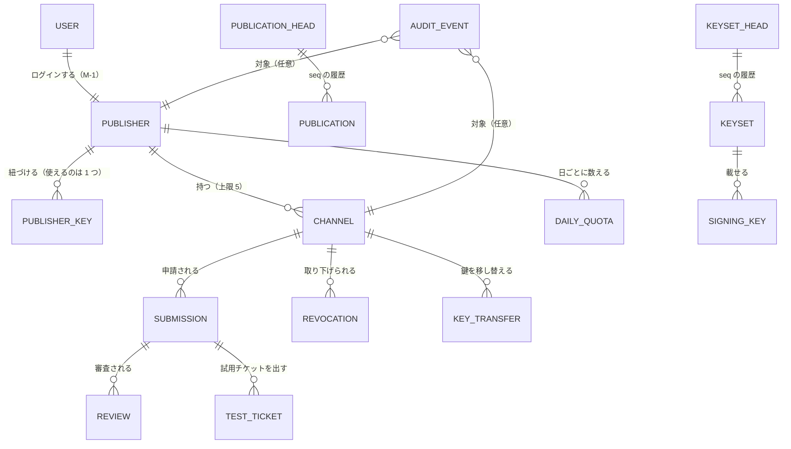
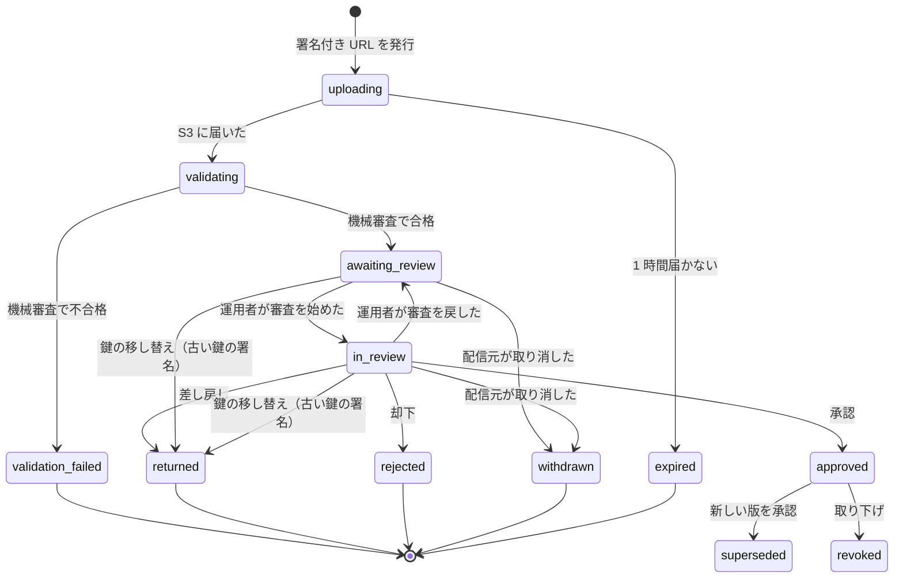

# チャンネル管理システム データモデル設計書

## 文書情報

| 項目 | 内容 |
|---|---|
| 文書ID | DM-001 |
| ドキュメント種別 | データモデル設計書 |
| 対象システム/機能 | チャンネル管理システム（DynamoDB の 1 テーブルと、S3 に置くもの） |
| 関連Skill | 020_data-model-design-unified |
| 作成日 | 2026-10-03 |
| 作成者 | Claude（開発者との検討） |
| 承認者 | 開発者（2026-10-03） |
| ステータス | 承認済 |
| 版 | 1.0 |

## 目的・背景

[ADR-001](adr/ADR-001-aws-architecture.md) A-6 で、データは DynamoDB の 1 テーブルに置き、パッケージ・アイコン・リストの本体は S3 に置くと決めた。本書は、そのテーブルの項目の種類、キー、インデックス、状態の移り方、上限（A-18）を決める（ADR-001 T-2）。

DynamoDB では、取り出し方（アクセスパターン）からキーを決める。本書は、先にアクセスパターンを挙げ、それを満たすキーを決める。

## スコープ・非スコープ

スコープ:
- 配信元、配信元の鍵、チャンネル、申請（版）、審査の記録、取り下げ、鍵の移し替え、公開の記録、鍵セット・署名鍵、試用チケット、上限の数え方、操作の記録、一度きりの文字列
- 申請・チャンネル・配信元・鍵の移し替えの状態の移り方
- S3 に置くものの名前の付け方と保持期間
- 書き込みの単位（トランザクション）と、同時に書かれたときの守り方

非スコープ:
- 管理システムの API（ADR-001 T-3。本書のアクセスパターンを入力にする）
- リストとパッケージの形式（SanpoGuide の API-002・API-003）
- Cognito のユーザー属性の詳細（メールアドレスなどは Cognito が持ち、本テーブルには複製しない）

## 対応元ID（トレーサビリティ）

| 対応元ID | 内容 | 対応状況 |
|---|---|---|
| ADR-001 | A-4（Cognito）、A-5（鍵の紐づけ）、A-6（1 テーブル）、A-7（公開の名前）、A-10（`seq`）、A-11〜A-13（受付・承認・試用）、A-15（鍵の移し替え）、A-16（操作の記録）、A-18（上限）、D-7（誰でも登録できる） | 本書でデータにする |
| SanpoGuide API-002 | `channels[]` の項目、`revoked[]`、`seq`・`expiresAt`、P-8（要約）、P-9（`publisherChange`）、鍵セット | 公開の Lambda が本書のデータから作る |
| SanpoGuide API-003 | `channel.json` の `id`・`version`・`publisher`、エラーコード | 申請に保存する |
| SanpoGuide channel-review-policy.md | 判定（承認・差し戻し・却下）、取り下げ | 審査の記録・取り下げにする |

## 方針・決定事項

### 決定事項（2026-10-03、開発者の回答）

| No. | 論点 | 決定 |
|---|---|---|
| M-1 | 配信元のアカウントの単位 | 1 ユーザー = 1 配信元。ただし、ユーザーと配信元は別の項目にしておき、あとで 1 つの配信元に複数のメンバーを足せるようにする |
| M-2 | A-18 の上限 | チャンネルは配信元ごとに 5 つ。審査待ちの申請は 1 チャンネルにつき 1 つ。申請（アップロード）は 1 日 20 回。試用チケットは 1 日 10 枚。運用者は配信元ごとに上限を変えられる |
| M-3 | 操作の記録 | 同じテーブルに期限なしで残す |
| M-4 | 承認されなかったパッケージ | 受付用の S3 に、その結果が出てから 90 日残して消す。承認したものは公開用のバケットに残る |

### 設計の決定（Claude の提案を開発者が承認。2026-10-03）

| No. | 論点 | 決定案 |
|---|---|---|
| M-5 | 申請と版の番号 | 申請は申請ID（ULID）で区別する。版の番号は配信元がパッケージに書くもので、差し戻しのあとは同じ番号で出し直せる。確かめるのは「最後に承認した版の番号より大きい」ことだけ（受付時と承認時の 2 回） |
| M-6 | チャンネルID | SanpoGuide の提供元の中で一意（API-002）。最初に登録した配信元が持ち、別の配信元は同じ ID を使えない。取り下げたチャンネルの ID も再利用しない |
| M-7 | 配信元のアカウントID（`sg1…`） | 1 つのアカウントIDを紐づけられるのは 1 つの配信元だけ。外した（移し替えた）アカウントIDも、別の配信元に紐づけ直せない |
| M-8 | リストに載せる内容 | チャンネルの項目に、最新の承認済みの版の「リストに載せる内容」を写しておく。公開の Lambda はそれを集めるだけで、パッケージを開かない |
| M-9 | 取り下げ | 取り下げると、そのチャンネルはリストから消える。前の承認済みの版に自動では戻さない（新しい版の承認が要る）。リストの `revoked` には、取り下げから 7 日載せる（開発者の決定）。7 日を過ぎてから初めてリストを取得した端末でも、リストに載っていないチャンネルは使わない（API-002 P-5）。違いは、パッケージを消して理由を知らせるかどうかだけ |
| M-10 | 配信元の停止 | 停止中は申請・試用チケット・鍵の紐づけを受け付けない。公開中のチャンネルはそのまま（止めるなら取り下げを別に行う。ADR-001 A-18 ④） |
| M-11 | 同時に書かれたときの守り方 | 状態が変わる項目には `rev`（書くたびに 1 増やす）を持たせ、条件付き書き込みで後勝ちの上書きを防ぐ。状態の移り方は、移る前の状態を条件にして守る |
| M-12 | 時刻と ID | 時刻は UTC の ISO 8601（ミリ秒まで）。1 日の上限は日本時間の日付で数える。新しく作る ID は ULID（作った順に並ぶ） |
| M-13 | 公開の記録の本体 | リストの本体（署名済み）は、公開用のバケットのほかに、記録用のバケットに `seq` ごとに期限なしで残す。DynamoDB には `seq`・SHA-256・保存場所だけを持つ |

## 概念モデル（ERD）

## 論理モデル

### アクセスパターン

| No. | 誰が | 何をする | 使うキー |
|---|---|---|---|
| AP-01 | 全員 | ログインしたユーザーから配信元を引く | `USER#{sub}` |
| AP-02 | 配信元・運用者 | 配信元を見る | `PUB#{publisherId}` / `PUB` |
| AP-03 | 配信元・運用者 | 配信元の鍵の一覧（今のものと過去のもの） | `PUB#{publisherId}` / `KEY#` |
| AP-04 | システム | アカウントIDがすでに使われていないか確かめる（M-7） | `ACCOUNT#{accountId}` |
| AP-05 | 配信元 | 自分のチャンネルの一覧 | GSI1 `PUB#{publisherId}` / `CH#` |
| AP-06 | 全員 | チャンネルを見る | `CH#{channelId}` / `CH` |
| AP-07 | 配信元・運用者 | チャンネルの申請の一覧（新しい順） | `CH#{channelId}` / `SUB#` |
| AP-08 | 運用者 | 申請の審査の記録 | `CH#{channelId}` / `SUB#{submissionId}#REVIEW#` |
| AP-09 | 運用者 | 審査待ちの一覧（古い順） | GSI2 `QUEUE#REVIEW` |
| AP-10 | 公開の Lambda | リストに載せるチャンネルをすべて集める | GSI2 `LISTED` |
| AP-11 | 公開の Lambda | `revoked` に載せる取り下げを集める（7 日以内） | GSI2 `REVOKED` |
| AP-12 | 運用者 | 鍵の移し替えの申し出の一覧 | GSI2 `QUEUE#TRANSFER` |
| AP-13 | 公開の Lambda | 今の `seq` を読み、1 つ進める | `PUBLICATION` / `HEAD` |
| AP-14 | 運用者 | 公開の履歴 | `PUBLICATION` / `SEQ#` |
| AP-15 | 公開の Lambda | 今の鍵セットと、使う署名鍵を引く | `KEYSET` / `HEAD`、`SIGNKEY` / `KEY#` |
| AP-16 | 配信元 | 申請の試用チケットの一覧 | `CH#{channelId}` / `SUB#{submissionId}#TICKET#` |
| AP-17 | システム | 今日の申請・試用チケットの数を確かめて増やす | `PUB#{publisherId}` / `QUOTA#{日付}` |
| AP-18 | 運用者 | 操作の記録を新しい順に見る | `AUDIT#{年月}` |
| AP-19 | 運用者・配信元 | 1 つのチャンネル・配信元の操作の記録 | GSI1 `TARGET#…` |
| AP-20 | 運用者 | 配信元の一覧（新しい順、停止中だけ） | GSI2 `PUBLISHERS` |
| AP-21 | 機械審査の Lambda | S3 のキーから申請を引く | S3 のキーに `channelId` と `submissionId` を入れる（引き直し不要） |
| AP-22 | システム | 鍵の紐づけの一度きりの文字列を確かめる | `PUB#{publisherId}` / `CHALLENGE#{nonce}` |

### 状態の移り方

**申請（SUBMISSION）**

- 「審査待ちの申請」（`uploading`・`validating`・`awaiting_review`・`in_review`）は 1 チャンネルにつき 1 つ（M-2）。チャンネルの `pendingSubmissionId` で守る
- `validation_failed`・`returned`・`rejected`・`withdrawn`・`expired` になったら、受付用の S3 のパッケージを `archive/` に移す（90 日で消える。M-4）
- `approved` になったら、パッケージとアイコンを公開用のバケットに写す

**チャンネル（CHANNEL）**: `active`（承認済みの版がなくてもよい）→ `revoked`（取り下げ）→ 新しい版の承認で `active` に戻る。取り下げ中はリストに載らない

**配信元（PUBLISHER）**: `pending_key`（登録直後。鍵の紐づけ待ち）→ `active` → `suspended`（運用者が停止）→ `active`（運用者が戻す）。`pending_key` と `suspended` のあいだは申請できない

**鍵の移し替え（KEY_TRANSFER）**: `requested`（配信元が新しい鍵を紐づけて申し出た）→ `approved`（運用者が本人確認して承認）／ `rejected`（認めない）／ `cancelled`（配信元が取り消した）

## 物理モデル

### テーブル

| 項目 | 内容 |
|---|---|
| テーブル名 | `sanpo-channel-console`（アカウントごとに 1 つ） |
| キー | `PK`（文字列）、`SK`（文字列） |
| 課金 | オンデマンド |
| 復旧 | ポイントインタイムリカバリを有効にする。削除保護を有効にする |
| TTL | 属性 `ttl`（UNIX 秒）。一度きりの文字列・上限の数・期限切れの申請だけに付ける |
| ストリーム | 使わない（操作の記録はトランザクションの中で書く） |
| GSI1 | `GSI1PK` / `GSI1SK`、射影は ALL。持ち主ごとの一覧と、対象ごとの操作の記録 |
| GSI2 | `GSI2PK` / `GSI2SK`、射影は ALL。疎なインデックス。審査待ち・リストに載せるもの・取り下げ・移し替え待ち・配信元の一覧 |

### 項目の種類とキー

| 種類 | PK | SK | GSI1PK / GSI1SK | GSI2PK / GSI2SK（あるときだけ） |
|---|---|---|---|---|
| ユーザー | `USER#{sub}` | `USER` | — | — |
| 配信元 | `PUB#{publisherId}` | `PUB` | — | `PUBLISHERS` / `{createdAt}` |
| 配信元の鍵 | `PUB#{publisherId}` | `KEY#{accountId}` | — | — |
| アカウントIDの予約 | `ACCOUNT#{accountId}` | `ACCOUNT` | — | — |
| 一度きりの文字列 | `PUB#{publisherId}` | `CHALLENGE#{nonce}` | — | — |
| 1 日の数 | `PUB#{publisherId}` | `QUOTA#{yyyy-mm-dd}` | — | — |
| チャンネル | `CH#{channelId}` | `CH` | `PUB#{publisherId}` / `CH#{channelId}` | 載せるとき `LISTED` / `CH#{channelId}` |
| 申請 | `CH#{channelId}` | `SUB#{submissionId}` | — | 審査待ちのとき `QUEUE#REVIEW` / `{submittedAt}#{channelId}` |
| 審査の記録 | `CH#{channelId}` | `SUB#{submissionId}#REVIEW#{at}` | — | — |
| 試用チケット | `CH#{channelId}` | `SUB#{submissionId}#TICKET#{issuedAt}` | — | — |
| 取り下げ | `CH#{channelId}` | `REVOKE#{revokedAt}` | — | 7 日のあいだ `REVOKED` / `{revokedAt}#{channelId}` |
| 鍵の移し替え | `CH#{channelId}` | `TRANSFER#{transferId}` | — | `requested` のとき `QUEUE#TRANSFER` / `{requestedAt}` |
| 公開の先頭 | `PUBLICATION` | `HEAD` | — | — |
| 公開の履歴 | `PUBLICATION` | `SEQ#{seq を 10 桁で 0 埋め}` | — | — |
| 鍵セットの先頭 | `KEYSET` | `HEAD` | — | — |
| 鍵セットの履歴 | `KEYSET` | `SEQ#{seq を 10 桁で 0 埋め}` | — | — |
| 署名鍵 | `SIGNKEY` | `KEY#{keyId}` | — | — |
| 操作の記録 | `AUDIT#{yyyy-mm}` | `{at}#{eventId}` | `TARGET#{種類}#{ID}` / `{at}` | — |

- 疎なインデックスの項目は、条件から外れたときに `GSI2PK`・`GSI2SK` を消す（例: 申請が `in_review` を出たら `QUEUE#REVIEW` から外れる）
- `REVOKED` から外すのは、公開の Lambda が毎日の作り直しのときに行う（7 日を過ぎたものの `GSI2PK` を消す）
- `AUDIT#{yyyy-mm}` は月ごとに 1 つのパーティションになる。書き込みは 1 秒に数件の想定で、パーティションの上限（1 秒に 1,000 件）に十分に収まる

## データ辞書

共通の属性: `type`（項目の種類）、`createdAt`、`updatedAt`、`rev`（状態が変わる項目だけ。M-11）

### 配信元（PUB）

| 属性 | 型 | 必須 | 内容 |
|---|---|---|---|
| `publisherId` | S | ○ | ULID |
| `ownerSub` | S | ○ | 持ち主の Cognito の `sub`（M-1） |
| `displayName` | S | ○ | リストの `publisherName` に使う。1〜40 文字 |
| `contact` | S | ○ | 審査・移し替えの連絡先（Cognito のメールとは別に持つ。本人確認の「別の経路」の候補。ADR-001 未決事項 No.6） |
| `status` | S | ○ | `pending_key` / `active` / `suspended` |
| `activeAccountId` | S | — | 使っている鍵のアカウントID（`sg1…`） |
| `channelCount` | N | ○ | 持っているチャンネルの数（取り下げたものも数える。上限の回避を防ぐため） |
| `limits` | M | — | 運用者が変えた上限（`channels`・`uploadsPerDay`・`ticketsPerDay`）。ないものは既定値（M-2） |
| `suspendedReason` | S | — | 停止の理由 |

### 配信元の鍵（KEY）

| 属性 | 型 | 必須 | 内容 |
|---|---|---|---|
| `accountId` | S | ○ | `sg1…` |
| `publicKey` | S | ○ | Ed25519 の公開鍵（base64url） |
| `boundAt` | S | ○ | 紐づけた日時（一度きりの文字列の署名を確かめた日時） |
| `unboundAt` | S | — | 外した日時 |
| `unboundReason` | S | — | `lost` / `leaked` / `other` と説明 |

アカウントIDの予約（`ACCOUNT#…`）には `publisherId` だけを持たせ、条件付き書き込み（まだないこと）で M-7 を守る。外したあとも消さない。

### チャンネル（CH）

| 属性 | 型 | 必須 | 内容 |
|---|---|---|---|
| `channelId` | S | ○ | 英小文字・数字・`-`、3〜40 文字（API-002） |
| `publisherId` | S | ○ | 持ち主 |
| `status` | S | ○ | `active` / `revoked` |
| `pendingSubmissionId` | S | — | 審査待ちの申請（M-2 の 1 つ） |
| `latestApproved` | M | — | 最新の承認済みの版（下表）。M-8 |
| `publisherChange` | M | — | `from`・`at`・`reason`・`until`。移し替えから 90 日（API-002 P-9）。`until` を過ぎたら公開の Lambda が載せなくなる |

`latestApproved` の中身（リストの `channels[]` の 1 件になる）:

| 属性 | 内容 |
|---|---|
| `submissionId`・`version` | 承認した申請と版の番号 |
| `publisher` | 署名したアカウントID |
| `name`・`summary`・`description`・`lang`・`tags`・`regions` | `channel.json` と申請の画面から |
| `icon` | `{ url, sha256 }`（公開用のバケットの `/icons/{sha256}.png`） |
| `package` | `{ url, sha256, size, format }`（`/pkg/{sha256}.zip`） |
| `minAppVersion` | 機械審査が出した、必要なアプリの段から決める |
| `approvedAt` | 承認した日時 |

### 申請（SUB）

| 属性 | 型 | 必須 | 内容 |
|---|---|---|---|
| `submissionId` | S | ○ | ULID |
| `version` | N | — | パッケージの `channel.json` の `version`（機械審査で読む）。M-5 |
| `accountId` | S | ○ | 申請したときの配信元のアカウントID |
| `state` | S | ○ | [状態の移り方](#状態の移り方)のとおり |
| `intakeKey` | S | ○ | 受付用の S3 のキー `intake/{channelId}/{submissionId}.zip` |
| `sha256`・`size` | S・N | — | 届いたパッケージ（機械審査で計算） |
| `validation` | M | — | `{ ok, errors: [{ code, detail }], appStage, checkedAt, validatorVersion }`。`code` は API-003 のエラーコード |
| `note` | S | — | 配信元から運用者への説明 |
| `submittedAt` | S | — | 機械審査に合格した日時（審査待ちの順番） |
| `decidedAt` | S | — | 承認・差し戻し・却下・取り消しの日時 |
| `ttl` | N | — | `uploading` のあいだだけ（1 時間）。届けば消す |

### 審査の記録（REVIEW）

| 属性 | 型 | 必須 | 内容 |
|---|---|---|---|
| `reviewerSub` | S | ○ | 運用者の Cognito の `sub` |
| `action` | S | ○ | `start` / `release`（審査を戻した） / `approve` / `return` / `reject` |
| `findings` | L | — | `[{ item: "2.2", detail }]`。審査基準の項目番号つき（channel-review-policy.md 3） |
| `samplesKey` | S | — | AI に話させた見本（JSON）の保存場所。記録用のバケットの `reviews/{submissionId}/{at}.json` |

### 取り下げ（REVOKE）

| 属性 | 型 | 必須 | 内容 |
|---|---|---|---|
| `versions` | L | — | 取り下げた版の番号。ないときはすべての版（API-002 `revoked[].versions`） |
| `reason` | S | ○ | 利用者に見せる理由 |
| `severity` | S | ○ | `high` / `low`（channel-review-policy.md「取り下げ」） |
| `operatorSub` | S | ○ | 取り下げた運用者 |

### 鍵の移し替え（TRANSFER）

| 属性 | 型 | 必須 | 内容 |
|---|---|---|---|
| `transferId` | S | ○ | ULID |
| `fromAccountId`・`toAccountId` | S | ○ | 前と後のアカウントID。`to` は申し出の前に紐づけ済み（A-5） |
| `reason` | S | ○ | `lost` / `leaked` / `other` |
| `publicReason` | S | ○ | リストの `publisherChange.reason` に載せる文 |
| `state` | S | ○ | `requested` / `approved` / `rejected` / `cancelled` |
| `verification` | M | — | 運用者が記録する本人確認（`method`・`detail`・`verifiedAt`） |
| `returnedSubmissions` | L | — | 承認のときに差し戻した申請（古い鍵の署名） |

### 公開の記録（PUBLICATION）

| 属性 | 型 | 必須 | 内容 |
|---|---|---|---|
| `seq` | N | ○ | API-002 の `seq` |
| `issuedAt`・`expiresAt` | S | ○ | リストに書いた値 |
| `sha256`・`size` | S・N | ○ | リスト本体の `payload` のバイト列（要約に書いた値） |
| `keyId` | S | ○ | 要約に署名した署名鍵 |
| `archiveKey` | S | ○ | 記録用のバケットの `published/{seq}.json` |
| `trigger` | S | ○ | `approve` / `revoke` / `transfer` / `keyset` / `daily` |
| `channelCount`・`revokedCount` | N | ○ | 載せた件数 |

先頭（`HEAD`）は最新の 1 件と同じ属性を持つ。公開の Lambda は `seq = :前に読んだ値` を条件に `HEAD` を書き換え、同じトランザクションで履歴を足す。

### 鍵セットと署名鍵

| 種類 | 主な属性 |
|---|---|
| 鍵セット（先頭・履歴） | `seq`、`document`（ルート鍵が署名した文書をそのまま）、`registeredBy`、`verifiedAt` |
| 署名鍵 | `keyId`（例: `k-2026-10`）、`kmsKeyArn`、`publicKey`、`notBefore`、`notAfter`、`status`（`active` / `retiring` / `revoked`）。公開の Lambda は、鍵セットに載っていて期間内の `active` の鍵を使う |

### 試用チケット（TICKET）

| 属性 | 型 | 必須 | 内容 |
|---|---|---|---|
| `issuedAt`・`expiresAt` | S | ○ | 7 日以内（API-002） |
| `trialKey` | S | ○ | 公開用のバケットの `trial/{sha256}.zip`（7 日で消える。A-13） |
| `document` | S | ○ | 署名済みのチケット（QR コードにするもの） |

### 1 日の数（QUOTA）

`uploads`・`tickets`（N）。日本時間の日付ごとの項目。`ADD` と条件（`uploads < :上限`）で増やす。`ttl` は 3 日後。

### 操作の記録（AUDIT）

| 属性 | 型 | 必須 | 内容 |
|---|---|---|---|
| `eventId` | S | ○ | ULID |
| `at` | S | ○ | 日時 |
| `actorSub`・`actorRole` | S | ○ | だれが（`publisher` / `operator` / `system`） |
| `action` | S | ○ | 例: `publisher.register`・`key.bind`・`submission.create`・`submission.approve`・`channel.revoke`・`transfer.approve`・`keyset.register`・`publication.publish`・`publisher.suspend`・`limits.update` |
| `target` | S | ○ | 例: `CH#kamakura-history`・`PUB#01J…` |
| `reason` | S | — | 理由（運用者の操作では必須） |
| `detail` | M | — | 前後の値など。秘密（API キー、トークン）は入れない |

## DDL方針

DynamoDB なので DDL はなく、テーブルとインデックスは CDK（`infra/`）で定義する。

- テーブル・GSI・TTL・ポイントインタイムリカバリ・削除保護は CDK で作る。手で変えない
- 項目の形は、`api/` の TypeScript の型と実行時の検証（zod など）で 1 か所に定義し、読むときにも検証する
- 状態を変える書き込みは、次の単位で `TransactWriteItems` にまとめる（すべて操作の記録を含む）

| 操作 | 1 つのトランザクションで書くもの |
|---|---|
| 配信元の登録 | ユーザー、配信元（`pending_key`） |
| 鍵の紐づけ | 一度きりの文字列の削除、アカウントIDの予約（まだないこと）、配信元の鍵、配信元（`activeAccountId`、`pending_key` → `active`） |
| チャンネルの登録 | チャンネル（まだないこと）、配信元（`channelCount < 上限`、`status = active`） |
| 申請の開始 | 1 日の数（`uploads < 上限`）、チャンネル（`pendingSubmissionId` がないこと）、申請（`uploading`） |
| 承認 | 申請（`in_review` → `approved`）、前の承認済みの申請（→ `superseded`）、チャンネル（`latestApproved`・`LISTED`、`pendingSubmissionId` を消す、`status` を `active` に）、審査の記録 |
| 取り下げ | 取り下げ、チャンネル（`revoked`、`LISTED` を外す）、承認済みの申請（→ `revoked`） |
| 移し替えの承認 | 移し替え（`requested` → `approved`）、チャンネル（`publisherChange`、審査待ちの申請を外す）、審査待ちの申請（→ `returned`）、古い鍵（`unboundAt`） |

- 承認・取り下げ・移し替えの承認・鍵セットの登録のあと、公開の Lambda を非同期で呼ぶ（ADR-001 A-10）
- 1 つのトランザクションは 100 件まで。上の操作は多くても 10 件ほど

### S3 に置くもの

| バケット | キー | 保持 |
|---|---|---|
| 受付用（非公開） | `intake/{channelId}/{submissionId}.zip` | 審査中は残す。結果が出たら `archive/` に移す |
| 受付用（非公開） | `archive/{channelId}/{submissionId}.zip` | 90 日で消す（ライフサイクル。M-4） |
| 公開用（CloudFront） | `.well-known/sanpo-channels`、`v1/channels.json` | 毎回上書き |
| 公開用（CloudFront） | `pkg/{sha256}.zip`、`icons/{sha256}.png` | 消さない（取り下げても、URL は残る。アプリはリストで止める） |
| 公開用（CloudFront） | `trial/{sha256}.zip` | 7 日で消す |
| 記録用（非公開） | `published/{seq}.json`、`keysets/{seq}.json`、`reviews/{submissionId}/{at}.json` | 消さない |

## 移行・互換性メモ

- 新しいシステムなので、移行するデータはない
- 項目に属性を足すのは互換性のある変更。読むときの検証は、知らない属性を無視する
- キーの形（PK・SK・GSI）を変えるときは、新しい形で書き、古い形の項目を一括で書き直すスクリプトを用意する。運用者が 1 人で件数が少ないうちは、メンテナンス時間を取って行ってよい
- 複数メンバーの配信元（M-1 の将来）は、`PUB#{publisherId}` / `MEMBER#{sub}` の項目を足し、ユーザーの項目を「どの配信元のメンバーか」に変えて対応する。今の `ownerSub` は最初のメンバーになる

## 検証観点

| No. | 観点 |
|---|---|
| DV-01 | AP-01〜AP-22 が、スキャンなしで（キーと GSI だけで）満たせる |
| DV-02 | 同じアカウントIDを 2 つの配信元に同時に紐づけようとすると、片方だけが成功する（M-7） |
| DV-03 | 同じチャンネルに 2 つの申請を同時に始めようとすると、片方だけが成功する（M-2） |
| DV-04 | 1 日の上限を超えた申請・試用チケットが、同時に送られても上限を超えない |
| DV-05 | 版の番号が最後に承認した版以下の申請は、受付時にも承認時にも通らない（M-5） |
| DV-06 | 2 人の運用者が同じ申請を同時に承認・差し戻ししても、どちらか一方だけが記録される（M-11） |
| DV-07 | 公開の Lambda が同時に 2 つ動いても、`seq` が重複しない |
| DV-08 | 移し替えを承認すると、古い鍵の署名の審査待ちの申請が `returned` になり、次の申請は新しい鍵でないと受け付けない |
| DV-09 | 取り下げたチャンネルがリストから消え、`revoked` に 7 日載り、8 日目の作り直しで外れる（M-9） |
| DV-10 | 状態を変える操作のすべてに、操作の記録が同じトランザクションで残る |
| DV-11 | 停止中の配信元は申請・試用チケット・鍵の紐づけができず、公開中のチャンネルはリストに残る（M-10） |
| DV-12 | 結果が出た申請のパッケージが `archive/` に移り、90 日で消える。承認したものは公開用のバケットに残る |
| DV-13 | 1 つの項目が 400KB を超えない（見本は S3 に置く。`validation.errors` は 100 件で打ち切る） |

## 制約

- DynamoDB の 1 つの項目は 400KB まで。大きなもの（見本、リストの本体、鍵セットの文書の履歴）は S3 に置く
- `TransactWriteItems` は 100 件まで、また同じ項目を 1 つのトランザクションで 2 回書けない
- GSI は結果整合性。審査待ちの一覧は、承認の直後に古い状態が一瞬見えることがある（承認自体は本体の項目の条件で守る）
- 取り下げても、公開用のバケットのパッケージの URL は残る（中身はハッシュで固定されている。止めるのはリスト）

## 未決事項・リスク

| No. | 内容 | 決める時期 |
|---|---|---|
| 1 | ~~`revoked` に載せる期間~~ → 解決（2026-10-03、7 日。M-9） | — |
| 2 | ~~`channelCount` に取り下げたチャンネルを数えるか~~ → 解決（2026-10-03、数える） | — |
| 3 | 却下（`rejected`）されたパッケージを、根拠として 90 日より長く残すか（M-4 では 90 日） | 運用の開始後 |
| 4 | 配信元が自分のアカウントを消したいときの扱い（チャンネルの取り下げ、操作の記録は残す） | API の契約書（T-3） |

## 関連ドキュメント・参照リンク

- [ADR-001](adr/ADR-001-aws-architecture.md): AWS の構成
- SanpoGuide [API-002](https://github.com/duwenji/SanpoGuide/blob/main/docs/channel-list-api.md): 承認済みチャンネル・リスト
- SanpoGuide [API-003](https://github.com/duwenji/SanpoGuide/blob/main/docs/channel-package-format.md): パッケージの形式
- SanpoGuide [channel-review-policy.md](https://github.com/duwenji/SanpoGuide/blob/main/docs/channel-review-policy.md): 審査基準（草案）
- 検討の記録: [skill-logs/data_model_design_2026-10-03.md](skill-logs/data_model_design_2026-10-03.md)

## 変更履歴

| 日付 | 版 | 変更内容 | 変更者 |
|---|---|---|---|
| 2026-10-03 | 0.1 | 草案（M-1〜M-4 は開発者の決定、M-5〜M-13 は提案） | Claude |
| 2026-10-03 | 1.0 | M-5〜M-13 を承認。`revoked` に載せる期間を 7 日に変更（M-9）。取り下げたチャンネルも上限に数える。未決事項 No.1・No.2 を解消 | Claude（承認: 開発者） |
