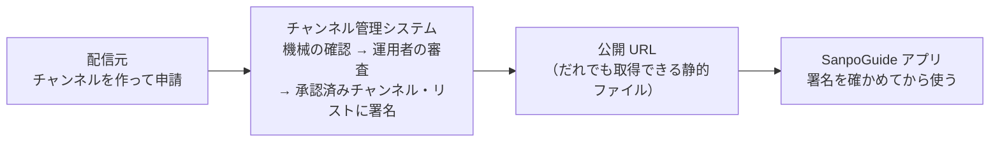

# チャンネル管理システム 利用ガイド

| 項目 | 内容 |
|---|---|
| 対象 | sanpo-channel-console（SanpoGuide の第三者のチャンネルを審査して公開するシステム） |
| 版 | 1.0（2026-10-04） |
| 前提の版 | 実装の順番 2（運用者の画面）まで。[DES-001](../design/DES-001-publisher.md)・[DES-002](../design/DES-002-operator-console.md) |

## このシステムでできること

SanpoGuide のアプリは、語り手・話題・雰囲気をまとめて切り替える「チャンネル」を持っています。このシステムは、第三者（観光協会、店舗、愛好会など）が作ったチャンネルを**運用者が審査し、合格したものだけを署名つきのリストにしてアプリに届ける**ためのものです。

アプリは、このシステムそのものではなく**署名**を信用します。システムが止まっても、アプリは最後に受け取ったリストで期限（最長 14 日）まで動きます。

## 読む人ごとの入口

| あなたは | 読むもの | 主にすること |
|---|---|---|
| **運用者**（審査・公開の責任者） | [運用者ガイド](operator.md) | ログイン、署名鍵と鍵セットの登録、公開の確認、配信元の停止、チャンネルの取り下げ、操作の記録の確認 |
| **配信元**（チャンネルを作る人） | [配信元ガイド](publisher.md) | 登録、鍵の紐づけ、パッケージの作成と署名、申請、試用、更新 |
| **開発・保守をする人** | [開発・保守ガイド](maintainer.md) | 手元での開発とテスト、配備、初期設定、運用者の追加、費用と監視、障害の対応 |
| どの立場でも、まず | [仕組み](concepts.md) | 鍵と署名の関係、チャンネルが公開されるまでの流れ |

## 「予定」の印

このガイドは、システムの全体の流れが分かるように、まだ作っていない機能も書いています。そうした箇所には次の印を付けています。実装したら印を外します。

| 印 | 意味 |
|---|---|
| （印なし） | 今使える |
| 🚧 **予定** | 契約書（[API-001](../console-api.md)）で決まっているが、まだ作っていない。画面・操作の細部は変わることがある |

2026-10-04 の時点で使えるのは、運用者の画面（審査を除く）と、開発・保守の道具です。配信元の画面、申請、機械審査、審査、鍵の移し替え、メールの通知は 🚧 予定です（[TODO](../TODO.md) の実装の順番 3）。

## 環境

| 環境 | 運用者の画面 | 公開 URL（アプリが取得する） | 状態 |
|---|---|---|---|
| 開発用（dev） | https://d3gvjt5e1ced74.cloudfront.net | https://d1vs7kc4zgmwrz.cloudfront.net | 稼働中。アプリには内蔵しない |
| 本番（prod） | — | — | 🚧 予定（本番用のアカウント、本番のルート鍵、独自ドメインがそろってから） |

## 用語集

| 用語 | 意味 |
|---|---|
| チャンネル | 語り手・話題・話す量・雰囲気をまとめた設定。アプリで切り替えて使う。ID は英小文字・数字・`-` の 3〜40 文字（例 `kamakura-history`） |
| パッケージ | 1 つのチャンネルの中身（`channel.json` とプロンプトの文章など）を ZIP にしたもの。形式は SanpoGuide の [API-003](https://github.com/duwenji/SanpoGuide/blob/main/docs/channel-package-format.md) |
| 版（version） | パッケージの版の番号。更新のたびに、最後に承認された版より大きくする |
| 申請 | パッケージを審査に出すこと。1 つのチャンネルに審査待ちの申請は 1 つまで |
| 配信元 | チャンネルを作って申請する人・団体。1 つのログインのアカウントが 1 つの配信元 |
| 運用者 | 審査・承認・取り下げ・鍵の管理をする人。管理者だけが作れる |
| 提供元 | 承認済みチャンネル・リストを出す主体（このシステムを運営する人）。ID は `sc1…` で、ルート鍵の指紋 |
| ルート鍵 | 提供元のいちばん大事な鍵。ネットワークにつながない端末に置き、鍵セットにだけ署名する。アプリはこの鍵の指紋（提供元ID）だけを信用する |
| 署名鍵 | AWS KMS の中にある鍵。リストに署名する。取り出せない。半年ごとに入れ替える |
| 鍵セット | どの署名鍵を使ってよいかの一覧。ルート鍵が署名する。署名鍵の追加・入れ替え・失効はこれで行う |
| 承認済みチャンネル・リスト | 承認されたチャンネルの一覧。署名鍵が署名し、公開 URL に置く。毎日作り直す |
| `seq` | リスト・鍵セットの通し番号。公開のたびに増える。アプリは小さくなったリストを拒む |
| 取り下げ | 承認したチャンネルをリストから外すこと。アプリは理由とともに使用を止める |
| アカウントID | 配信元の鍵の指紋（`sg1…`）。配信元はパッケージにこの鍵で署名する |
| 試用チケット | 🚧 審査前のチャンネルを、配信元が自分の端末で試すための QR コード。7 日で切れる |
| 準拠テスト | 提供元の公開 URL が API-002 の決まりを守っているかを外から確かめる道具 |
| 操作の記録 | 運用者・配信元の状態を変える操作を、だれが・いつ・何を・なぜしたか残したもの。消さない |

## 関連する文書

| 文書 | 内容 |
|---|---|
| [ADR-001](../adr/ADR-001-aws-architecture.md) | AWS の構成と、その理由 |
| [DM-001](../data-model.md) | データの持ち方と状態の移り方 |
| [API-001](../console-api.md)・[OpenAPI](../api/console.openapi.yaml) | 管理 API の契約 |
| SanpoGuide [API-002](https://github.com/duwenji/SanpoGuide/blob/main/docs/channel-list-api.md) | 承認済みチャンネル・リストの形式（アプリとの約束） |
| SanpoGuide [API-003](https://github.com/duwenji/SanpoGuide/blob/main/docs/channel-package-format.md) | パッケージの形式 |
| SanpoGuide [審査基準](https://github.com/duwenji/SanpoGuide/blob/main/docs/channel-review-policy.md) | 何を確かめて承認・差し戻しにするか（草案・未承認） |
| [配備の手順](../operations/deploy.md)・[費用](../operations/cost.md) | 環境ごとの値と手順 |
