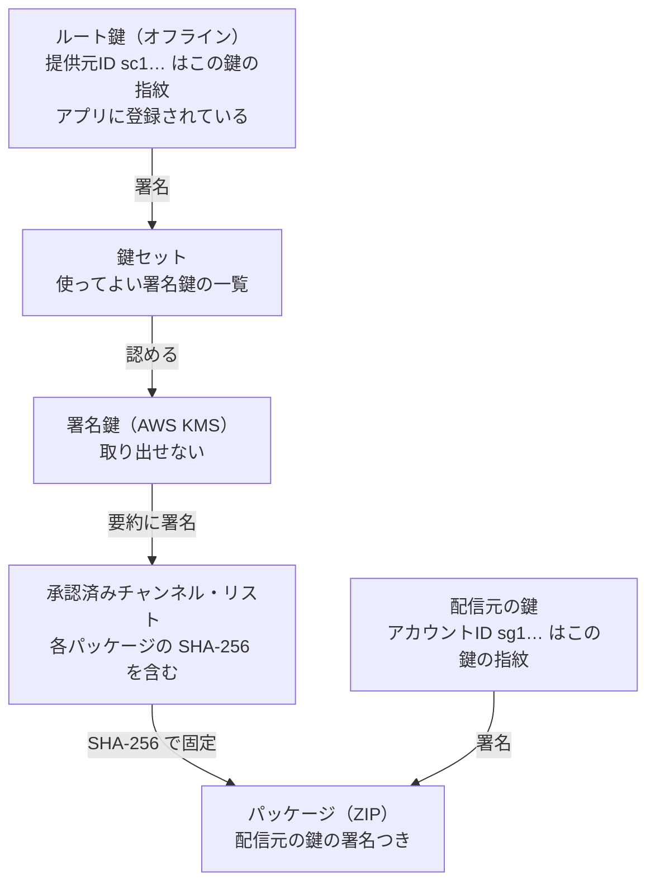
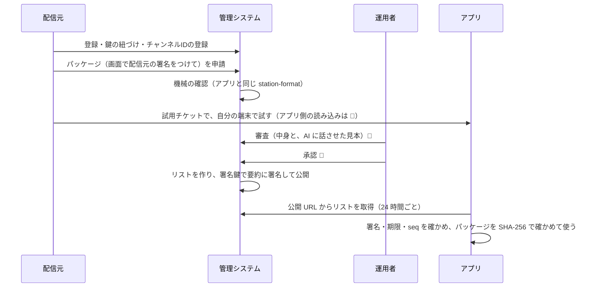
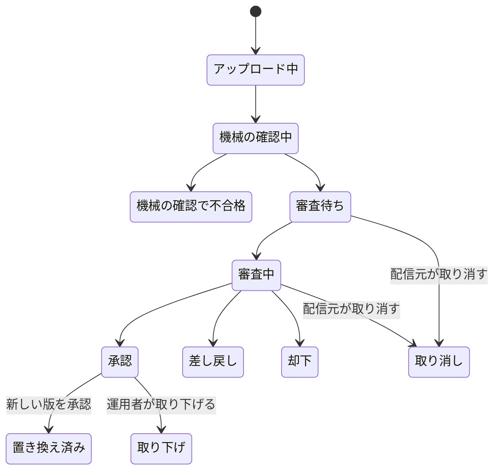

# 仕組み

[利用ガイド](README.md) ＞ 仕組み

このページは、どの立場の人にも共通の前提です。操作の手順は、立場ごとのガイドにあります。

## 1. 信頼のつながり

アプリは「だれが作ったか」「審査を通ったか」「途中で書き換えられていないか」を、すべて署名とハッシュで確かめます。置き場所（CloudFront）や通信経路は信用しません。

| 鍵 | だれが持つ | 何に署名する | 失ったとき・漏れたとき |
|---|---|---|---|
| ルート鍵 | 運用者（オフラインの端末、複数の場所に写し） | 鍵セットだけ | 署名鍵を入れ替えられなくなる。新しい提供元になり、アプリの更新が要る（開発用は作り直せばよい） |
| 署名鍵 | AWS KMS（だれも取り出せない） | リストの要約、試用チケット | 管理システムが乗っ取られたら、ルート鍵で新しい鍵セットを作って失効させる |
| 配信元の鍵 | 配信元（自分の端末だけ） | 自分のパッケージ | 🚧 運用者の本人確認のうえで、新しい鍵に移し替える |

リストに直接ではなく「要約」に署名するのは、KMS が一度に署名できるのが 4,096 バイトまでだからです。要約はリスト本体の SHA-256 を含むので、本体を書き換えれば合わなくなります。

## 2. チャンネルが公開されるまで

承認のあとの「リストを作って署名して公開する」部分は、今動いています。運用者の画面からの手動の公開、鍵セットの登録、取り下げ、毎日 03:00 の作り直しで、同じ処理が走ります。

## 3. チャンネルと申請の状態

**申請**（1 回のパッケージの提出。機械の確認までと取り消しは使える。審査からあとは 🚧）

- 1 つのチャンネルに、審査待ちの申請は 1 つだけです
- 差し戻されたら、直して新しい申請を出します（版の番号は同じでもよい）

**チャンネル**: `active`（有効）と `revoked`（取り下げ）の 2 つ。取り下げたチャンネルは、新しい版が承認されると `active` に戻ります。前に承認された版に自動では戻りません。

**配信元**: `pending_key`（鍵の紐づけ待ち）→ `active`（有効）⇄ `suspended`（運用者が停止）。退会すると `deleted`。

## 4. リストが届くまでの時間と、届かない場合

| できごと | アプリに届くまで |
|---|---|
| 承認・取り下げ・鍵セットの登録・手動の公開 | 公開は数秒。アプリは次の取得（起動時と散歩の開始時、前回から 24 時間以上たっていれば）で受け取る。公開 URL のキャッシュは 5 分 |
| 何もしない日 | 毎日 03:00（日本時間）に作り直し、期限（14 日）を延ばす |
| 管理システムが止まった | アプリは前回のリストで、その期限まで動く。期限が切れた提供元のチャンネルは、次の散歩から使わない |
| 取り下げ | リストから消え、`revoked` に理由とともに 7 日載る。7 日より後に初めて取得した端末も、リストにないチャンネルは使わない（理由の表示とパッケージの削除だけがない） |

## 5. 決まりの一覧（上限）

| 決まり | 値 | 根拠 |
|---|---|---|
| 1 つの配信元のチャンネル数 | 5（運用者が変えられる。取り下げたものも数える） | DM-001 M-2 |
| 1 日の申請（アップロード） | 20（日本時間で数える） | DM-001 M-2 |
| 1 日の試用チケット | 10 | DM-001 M-2 |
| パッケージの大きさ | 2MB | API-002 |
| アイコン | PNG、256×256 以下、100KB 以下 | API-001 |
| リストの期限 | 発行から 14 日以内 | API-002 |
| 署名鍵の有効期間 | 鍵セットで 1 年以内（画面の既定は 180 日） | API-002 |
| 試用チケットの期限 | 7 日 | API-002 |
| 取り下げを `revoked` に載せる期間 | 7 日 | DM-001 M-9 |
| 承認されなかったパッケージの保存 | 90 日 | DM-001 M-4 |
| 操作の記録の保存 | 消さない | DM-001 M-3 |
