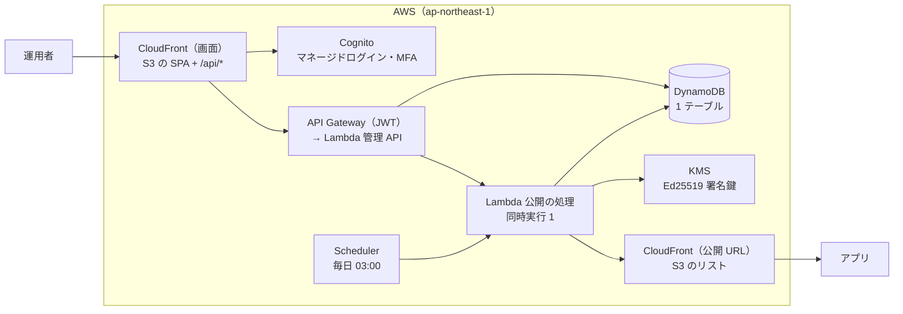

# 開発・保守ガイド

[利用ガイド](README.md) ＞ 開発・保守ガイド

このシステムを手元で動かし、変更し、AWS に配備し、動き続けさせるための手順です。

## 目次

1. [全体の構成](#1-全体の構成)
2. [準備](#2-準備)
3. [手元での開発とテスト](#3-手元での開発とテスト)
4. [変更の進め方](#4-変更の進め方)
5. [配備](#5-配備)
6. [提供元の初期設定](#6-提供元の初期設定)
7. [運用者を足す・外す](#7-運用者を足す外す)
8. [署名鍵を足す](#8-署名鍵を足す)
9. [費用と監視](#9-費用と監視)
10. [障害の対応](#10-障害の対応)
11. [困ったとき](#11-困ったとき)
12. [文書の地図](#12-文書の地図)

## 1. 全体の構成



| 場所 | 中身 | 設計書 |
|---|---|---|
| `packages/protocol` | API-002 の文書の作成と検証（署名、要約、ID、エラーコード） | DES-001 |
| `packages/api-types` | 管理 API の型（`docs/api/console.openapi.yaml` から生成） | DES-002 |
| `api/src/publish` | 公開の処理（Lambda）。DB・S3・CloudFront・KMS は差し替え口の後ろ | DES-001 |
| `api/src/console` | 管理 API（Lambda。運用者の操作 `operator.ts`、配信元の操作 `publisher.ts`、審査 `review.ts`、鍵の移し替え `transfer.ts`）と Cognito の post-confirmation トリガー | DES-002〜DES-006 |
| `api/src/notify` | 配信元へのメール（SQS で受けて SES で送る Lambda。開発用は記録だけ） | DES-006 |
| `validator` | 機械審査の Lambda（Kotlin、Gradle、station-format） | DES-004 |
| `web` | 運用者・配信元の画面（React + Vite）。配信元の鍵の作成と署名は `web/src/publisher-crypto.ts` | DES-002・DES-003 |
| `tools/root-key` | ルート鍵の CLI（オフラインの端末で使う） | DES-001 |
| `tools/provision` | 配備した提供元の初期設定（署名鍵・鍵セットの登録と初回の公開） | DES-001 |
| `tools/e2e` | 開発用の環境での通しの確認（機械審査、試用チケット、審査と承認、鍵の移し替えとメール） | DES-004〜DES-006 |
| `conformance` | 任意の提供元に対する準拠テスト | DES-001 |
| `infra` | AWS CDK。環境ごとの設定は `infra/lib/config.ts` | ADR-001 |

機械審査の Lambda（`validator`）は、SanpoGuide の `station-format` を GitHub Packages（`com.example.sanpoguide:station-format`）から読み込みます。読むには `read:packages` のトークンが要ります（CI は `GITHUB_TOKEN`。手元は `~/.gradle/gradle.properties` に `gpr.user`・`gpr.key` を書くか、SanpoGuide で `./gradlew :station-format:publishToMavenLocal`）。

## 2. 準備

| 道具 | 版・メモ |
|---|---|
| Node.js | 22 以上（Lambda は Node.js 22） |
| Docker | 管理 API のテストが DynamoDB Local を起動する |
| JDK 17 以上 | 機械審査（`validator`）のビルド。Lambda は Java 21 で動く |
| AWS CLI v2 | Windows は `C:\Program Files\Amazon\AWSCLIV2`。Git Bash の PATH に入っていないことがある |
| AWS の認証 | IAM Identity Center（SSO）のプロファイル。開発用は `sanpo-dev`（`aws configure sso --profile sanpo-dev`） |
| GitHub CLI | PR と CI の確認 |

```sh
git clone https://github.com/duwenji/sanpo-channel-console.git
cd sanpo-channel-console
npm ci
```

## 3. 手元での開発とテスト

```sh
npx tsc -b              # 型の確認（TypeScript 7）
npx vitest run          # すべてのテスト（Docker が要る）
npm run build -w web    # 画面をビルド（cdk synth の前に要る）
(cd validator && ./gradlew test lambdaZip)   # 機械審査をテストしてビルド（cdk synth の前に要る。JDK 17 以上）
```

| テスト | 何を確かめるか |
|---|---|
| `packages/protocol/test` | 署名・要約・ID、改ざん・期限切れ・巻き戻しを正しいエラーで拒むこと |
| `api/test/publisher.test.ts` | 公開の処理（seq、有効な鍵だけ、食い違えば何も公開しない、取り下げ 7 日）と KMS・DynamoDB への要求の形 |
| `api/test/console.test.ts` | 管理 API を DynamoDB Local で通しで。If-Match、状態、操作の記録、鍵セット、取り下げ、公開の処理との整合 |
| `api/test/publisher-api.test.ts` | 配信元の操作を DynamoDB Local で通しで。鍵の紐づけ、上限、申請、取り消し、退会 |
| `web/test` | 画面の暗号（鍵のファイル、アカウントID、パッケージの署名）を Node の WebCrypto で |
| `tools/root-key/test` | ルート鍵の暗号化、鍵セットの確認と署名 |
| `conformance/test` | 公開 → 手元の HTTP サーバー → 準拠テストの通しと、壊れた提供元を見つけること |
| `infra/test` | CDK の構成（MFA 必須、KMS の鍵ポリシー、CSP、開発用と本番の違い） |

DynamoDB Local は `$DYNAMODB_ENDPOINT` があればそれを使い、なければ Docker でコンテナを起動します（CI はサービスのコンテナ）。

**AWS なしで提供元を試す**:

```sh
npm run publish:local -w api            # ../.local/site に使い捨ての鍵で公開し、提供元ID を表示
npm run serve -w conformance            # http://127.0.0.1:8787
npm run check -w conformance -- http://127.0.0.1:8787 --allow-local-http --provider <提供元ID>
```

**画面を手元で動かす**（開発用の API とログインを使う）:

```sh
CONSOLE_URL=https://d3gvjt5e1ced74.cloudfront.net npm run dev -w web   # http://localhost:5173
```

**管理 API を変えるとき**: 先に `docs/api/console.openapi.yaml` と `docs/console-api.md` を直し、`npm run generate -w packages/api-types` で型を作り直します。

## 4. 変更の進め方

- 設計の判断は、文書（ADR・API・DM・DES）を書いて開発者の承認を得てから実装します（`docs/skill-logs/` に経緯）
- `main` に直接入れず、ブランチから PR を出します。CI（型の確認・テスト・画面のビルド・`cdk synth`）が通ることを確かめます
- テキストの改行は LF に固定しています（`.gitattributes`）。署名やハッシュはバイト単位で比べるためです

## 5. 配備

環境ごとの値は [配備の手順](../operations/deploy.md) にあります。

```sh
aws sso login --profile sanpo-dev
export AWS_PROFILE=sanpo-dev
npm run build -w web
cd infra
npx cdk diff   -c env=dev -c rootPublicKey=<ルート鍵の公開鍵>
npx cdk deploy -c env=dev -c rootPublicKey=<ルート鍵の公開鍵>
```

- **配備の前に必ず `cdk diff` を見ます**。`[-]`（削除）や置き換えがあれば、意図したものか確かめます。DynamoDB のテーブル、KMS の鍵、Cognito のユーザープールの置き換えは、データ・鍵・利用者を失います
- `rootPublicKey` を間違えると、公開の処理が鍵セットを拒み、公開できなくなります（署名を誤って出すことはありません）
- 本番（`-c env=prod`）はまだ配備しません。本番用のアカウント、本番のルート鍵（T-5）、独自ドメイン（T-7）、SES（T-8）がそろってから
- 開発用のカーソルの鍵は合成のたびに変わるので、配備すると画面の「さらに読み込む」の続きが切れます（読み込み直せば直る）

## 6. 提供元の初期設定

新しい環境では、配備のあとに一度だけ行います。

1. **ルート鍵を作る**（オフラインの端末、Git の作業ツリーの外）

   ```sh
   ROOT_KEY_PASSPHRASE=… npm run root-key -w tools/root-key -- generate --out <フォルダ>
   ```

   表示された `rootKey` を `cdk deploy -c rootPublicKey=…` に使い、`provider`（提供元ID）を控えます。合言葉は 16 文字以上。秘密鍵の写しを複数の場所に置きます。開発用の鍵は `~/.sanpo-channel-console/dev/` にあります（合言葉も同じ場所。開発用だけの扱い）
2. **署名鍵と鍵セットを登録して公開する**: 運用者の画面（[運用者ガイド 5.2](operator.md#52-鍵セットを登録する)）で行うか、`tools/provision` で一度に行います

   ```sh
   npm run provision -w tools/provision -- --env dev --root-key ~/.sanpo-channel-console/dev
   ```

   `provision` は、スタックの出力から KMS の鍵を読んで登録し、ルート鍵で鍵セット（署名鍵の有効期間 180 日）に署名して登録し、公開の処理を 1 回呼びます。済んでいる手順は飛ばします
3. **準拠テスト**

   ```sh
   npm run check -w conformance -- <公開 URL> --provider <提供元ID>
   ```

## 7. 運用者を足す・外す

運用者は、登録の画面からはなれません（ADR-001 A-4）。管理者が作って `operator` グループに入れます。

```sh
P=<ユーザープールID>   # 開発用は ap-northeast-1_wfKw6aCwX
aws cognito-idp admin-create-user --user-pool-id $P --username <メール> \
  --user-attributes Name=email,Value=<メール> Name=email_verified,Value=true --desired-delivery-mediums EMAIL
aws cognito-idp admin-add-user-to-group --user-pool-id $P --username <メール> --group-name operator
```

| したいこと | コマンド |
|---|---|
| 運用者を外す | `admin-remove-user-from-group … --group-name operator`（アカウントは残る）、または `admin-disable-user` |
| MFA の端末をなくした運用者の登録をやり直す | `admin-set-user-mfa-preference --user-pool-id $P --username <メール> --software-token-mfa-settings Enabled=false,PreferredMfa=false` のあと、次のログインで MFA をもう一度登録させる。うまくいかなければ、アカウントを作り直す |
| 仮のパスワードをもう一度送る | `admin-create-user … --message-action RESEND` |

## 8. 署名鍵を足す

半年ごとの入れ替え（[運用者ガイド 5.3](operator.md#53-署名鍵の入れ替え半年ごと)）のために、新しい KMS の鍵を作るのは開発・保守の担当です。

1. `infra/lib/config.ts` の `signingKeyIds` に新しい鍵 ID（例 `k-2027-04`）を足す
2. `cdk diff` で KMS の鍵とエイリアスが増えるだけなのを確かめ、配備する
3. 出力の `SigningKeyArn<n>` を運用者に渡す。以後は運用者の画面で登録する

鍵 ID を `signingKeyIds` から外しても、KMS の鍵は消えません（削除のときも残す設定）。使わなくなった鍵の削除は、鍵セットで失効させてから、KMS の画面で削除を予約します。

## 9. 費用と監視

| 項目 | 開発用 | 本番 |
|---|---|---|
| 月の費用の目安 | 約 1.5 USD（[費用](../operations/cost.md)） | 約 9 USD〜（WAF を含む） |
| 予算の通知 | 月 5 USD（実績 80%、予測 100% で tofumiyoshi@gmail.com へ） | 本番の配備時に決める |
| 警報 | `PublishFailures`（公開の失敗）、`NoRecentPublication`（2 日公開なし） | 同じ |
| 警報の宛先 | **未設定**（`cdk deploy -c alarmEmail=…` か `config.ts` で設定する） | 配備前に設定する |
| ログ | Lambda のログは 14 日 | 消さない |

- 予算はタグ `project=sanpo-channel-console` の費用だけを数えます。請求の画面でコスト配分タグ `project` を一度有効にしてください（[費用](../operations/cost.md#一度だけ要る操作)）
- 同じ AWS アカウントにほかのプロジェクトがあるので、請求の画面ではタグ `project` で絞り込みます

## 10. 障害の対応

| 事態 | 確かめること | 対処 |
|---|---|---|
| 公開が失敗する（警報 `PublishFailures`） | 公開の Lambda のログ。よくある原因: 鍵セットがない・ルート鍵と合わない、`active` の署名鍵がない（期限切れ）、KMS の権限 | 鍵セットの登録・署名鍵の入れ替え（運用者）。設定の誤りなら直して配備 |
| 2 日公開がない（警報 `NoRecentPublication`） | Scheduler が動いているか、Lambda が失敗していないか | 運用者の画面で手動の公開。リストの期限（14 日）までに直す |
| 画面がエラー（サーバーで問題が起きました） | 画面に出た `instance` で、管理 API の Lambda のログを検索する | 原因を直して配備 |
| 準拠テストが落ちる | どの V-xx か | V-01・V-02 → 鍵セット／ルート鍵、V-03 → 署名鍵、V-04 → 公開が止まっている、V-07 → パッケージの置き場所 |
| 管理システムの乗っ取りの疑い | CloudTrail（KMS の Sign、Cognito の管理操作）、操作の記録 | 運用者が新しい署名鍵に切り替え、古い鍵を失効（[運用者ガイド 11](operator.md#11-緊急時の対応)）。運用者のパスワードと MFA をやり直す |

## 11. 困ったとき

| 症状 | 原因と対処 |
|---|---|
| `Token has expired` / `The SSO session … has expired` | `aws sso login --profile sanpo-dev` でログインし直す |
| Git Bash で `aws … --log-group-name /aws/…` などが「パターンに合わない」 | Git Bash が `/` で始まる引数を Windows のパスに書き換えている。`MSYS_NO_PATHCONV=1` を付けて実行する |
| `aws` コマンドが見つからない | `"/c/Program Files/Amazon/AWSCLIV2/aws.exe"` を直接呼ぶか、PATH に足す |
| 管理 API のテストが起動しない | Docker が動いているか。または `DYNAMODB_ENDPOINT` を手元の DynamoDB Local に向ける |
| `cdk synth` が「build the SPA first」 | `npm run build -w web` を先に実行する |
| 署名やハッシュが手元と CI で合わない | 改行が CRLF になっていないか（`git ls-files --eol`）。`.gitattributes` で LF に固定している |
| `cdk deploy` が bootstrap の版を求める | 開発用のアカウントの CDKToolkit（版 25）は、ほかのプロジェクトと共有している。`cdk bootstrap` で上げる前に影響を確かめる |
| ヒアドキュメントで長いファイルを書くと崩れる（Claude Code の Bash） | ファイルの書き込みの道具で書く |

## 12. 文書の地図

| 文書 | いつ読むか |
|---|---|
| [ADR-001](../adr/ADR-001-aws-architecture.md) | 構成を変えるとき。なぜ今の形かを知りたいとき |
| [DM-001](../data-model.md) | テーブルの項目・キー・状態の移り方を変えるとき |
| [API-001](../console-api.md)・[OpenAPI](../api/console.openapi.yaml) | 管理 API を変えるとき（OpenAPI が入出力の正本） |
| [DES-001](../design/DES-001-publisher.md)・[DES-002](../design/DES-002-operator-console.md) | 実装の判断と検証の結果 |
| [TODO](../TODO.md) | 次にやること、実装の順番、決めたこと |
| [配備の手順](../operations/deploy.md)・[費用](../operations/cost.md) | 環境ごとの値、手順、費用 |
| `docs/skill-logs/` | 判断の経緯 |
| SanpoGuide の API-002・API-003・審査基準 | アプリとの約束（リスト・パッケージ・審査） |
