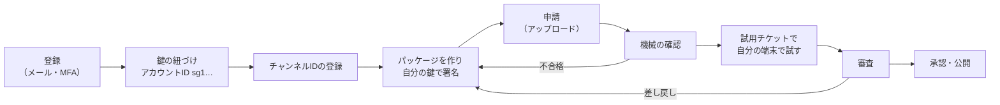

# 配信元ガイド

[利用ガイド](README.md) ＞ 配信元ガイド

SanpoGuide のアプリに、あなたのチャンネルを届けるための手順です。チャンネルは、運用者の審査に通ったものだけが公開されます。

> 配信元の画面: https://d3gvjt5e1ced74.cloudfront.net（開発用）。登録・鍵の紐づけ・チャンネルの登録・申請（アップロード）・取り消し・退会は使えます。**機械の確認・試用チケット・審査・鍵の移し替え・結果のメールは 🚧 予定**（実装の順番 3b〜3d）で、それまで申請は「アップロード待ち」のままです。

## 目次

1. [全体の流れ](#1-全体の流れ)
2. [登録と鍵の紐づけ](#2-登録と鍵の紐づけ)
3. [パッケージを作る](#3-パッケージを作る)
4. [申請する](#4-申請する)
5. [試用チケットで試す](#5-試用チケットで試す) 🚧
6. [審査の結果](#6-審査の結果) 🚧
7. [更新する](#7-更新する)
8. [鍵をなくした・漏れたとき](#8-鍵をなくした漏れたとき) 🚧
9. [退会する](#9-退会する)
10. [上限](#10-上限)

## 1. 全体の流れ



## 2. 登録と鍵の紐づけ

1. **アカウントを作る**: 管理システムの画面で、メールアドレスで登録します。届いた確認コードを入れ、認証アプリで MFA（TOTP）を登録します。MFA はすべての利用者に必須です
2. **配信元として登録する**: 表示名（1〜40 文字。アプリの一覧に出ます）と連絡先（審査や本人確認に使います）を入れます
3. **鍵を紐づける**: あなたの Ed25519 の鍵を、管理システムに紐づけます
   - 鍵はあなたの端末で作り、**秘密鍵は管理システムに送りません**。画面が一度きりの文字列を出し、あなたの鍵でそれに署名して、持ち主であることを示します
   - 紐づけると、公開鍵の指紋が**アカウントID**（`sg1` で始まる 35 文字）になります。パッケージにはこの鍵で署名します
   - 1 つのアカウントIDは、1 つの配信元にしか紐づけられません。外した鍵も再利用できません
   - 秘密鍵は、なくさないよう安全に保管してください。なくすと、運用者の本人確認を経ないと更新できなくなります（[8 章](#8-鍵をなくした漏れたとき)）
4. **チャンネル ID を登録する**: 英小文字・数字・`-` の 3〜40 文字（例 `kamakura-history`）。最初に登録した配信元のものになり、取り下げたあとも再利用できません

鍵は画面の中（ブラウザの WebCrypto）で作り、秘密鍵は**合言葉で暗号化したファイル**としてあなたが保存します（合言葉は 12 文字以上）。ファイルの写しを、なくさない場所に必ず取ってください。Chrome・Edge・Firefox・Safari の最新版で使えます。

## 3. パッケージを作る

パッケージは、1 つのチャンネルの中身を入れた ZIP（無圧縮か Deflate）です。正式な形式は SanpoGuide の [API-003](https://github.com/duwenji/SanpoGuide/blob/main/docs/channel-package-format.md) です。アプリと管理システムは、同じ確認のプログラム（station-format）で確かめます。

### 3.1 ファイルの構成

```
channel.json                 設定（必須）
signature.json               あなたの署名（必須）
prompts/
├── guide/
│   ├── persona.md           スポットの解説の語り手（役割・口調）     600 字まで
│   └── focus.md             解説で重点を置くこと                       1,000 字まで
└── companion/
    ├── persona.md           散歩の友の語り手                           600 字まで
    ├── topics.md            雑談の話題の選び方                         1,000 字まで
    └── events/              出来事ごとの追加の指示（各 300 字まで）
        ├── start.md  revisit.md  milestone.md  rest.md  finish.md
```

- ここにないファイル・フォルダを入れると、パッケージ全体が拒まれます
- `prompts/` の下はすべて任意です。ないものには、アプリの標準のチャンネルの文章が入ります
- 文章の合計は 4,000 字まで。UTF-8（BOM なし）、改行は LF（CR を含むと拒まれます）
- 文章に `{{`、URL（`http://`・`https://`・`www.`）、見出し（`#` で始まる行）を書けません
- 天気の急変・日の入り・施設の案内には指示を書けません。これらはどのチャンネルでもアプリが同じ言葉で知らせます
- 素材（画像・音声など）ときっかけ（`resources`・`cues`）は形式では決まっていますが、アプリがまだ対応していないので、今は使うと拒まれます

### 3.2 channel.json

```json
{
  "format": 1,
  "id": "kamakura-history",
  "version": 3,
  "publisher": "sg1…（あなたのアカウントID）",
  "name": "鎌倉歴史散歩",
  "summary": "鎌倉の寺社と武士の歴史を、語り部の口調で",
  "lang": "ja",
  "greeting": "ここからは、鎌倉の歴史をたどりながら歩きましょう。",
  "talk": { "level": "normal", "events": { "spot": true, "revisit": true, "milestone": true, "rest": false, "start": true, "finish": true } },
  "spots": { "prefer": ["temple", "shrine", "historic", "museum"], "skip": ["artwork"] },
  "guide": { "length": "long" },
  "mood": { "tone": true, "sound": "temple" }
}
```

| 項目 | 決まり |
|---|---|
| `id`・`version` | 登録したチャンネル ID。版は、最後に承認された版より大きく |
| `publisher` | 紐づけたアカウントID |
| `name`・`summary`・`greeting` | 1〜20 字・1〜60 字・1〜60 字（`greeting` は切り替えたときにそのまま読み上げる） |
| `talk.level` | `quiet`・`normal`・`chatty` |
| `talk.events` | 6 つの出来事（スポットの解説、再訪、区切り、休憩、開始、終了）で話すか。6 つとも必須 |
| `spots.prefer`・`skip` | 優先する・話題にしないスポットの種類（`shrine`、`temple`、`historic`、`museum`、`park`、`garden`、`viewpoint` など 15 種）。重ねられない |
| `guide.length` | `short`（100〜150 字）・`normal`（200〜300 字）・`long`（300〜450 字） |
| `mood` | `tone`（雰囲気に合わせるか）と `sound`（背景音: `auto`・`rain`・`waves`・`wind`・`birds`・`insects`・`temple`） |

### 3.3 signature.json

`signature.json` 以外のすべてのファイルの SHA-256 の一覧に、あなたの鍵で署名したものです。アプリは、公開鍵から計算したアカウントIDが `channel.json` とリストの `publisher` に一致するか確かめます。形式は API-003「signature.json」。**`signature.json` は自分で作りません**: 申請の画面に署名前の ZIP を渡すと、画面があなたの鍵ファイルで署名して足します。

### 3.4 内容の決まり（審査基準）

審査では、機械の確認に加えて、運用者が中身と AI に話させた見本を確かめます。基準は SanpoGuide の [審査基準](https://github.com/duwenji/SanpoGuide/blob/main/docs/channel-review-policy.md)（**草案・未承認**）です。主な観点:

- 語り口と内容（2.1）、安全（2.2: 危険な場所・立入禁止・私有地に誘わない）、プライバシー（2.3: 位置・住所・名前などを尋ねさせない）、宣伝（2.4）、AI への指示の書き方（2.5）
- 情報の少ない小さなスポットで、もっともらしい歴史を作らせないこと（2.7）

どのチャンネルでも、アプリが最後に「共通の指示」（個人情報を尋ねない、購入を勧めない、URL・電話番号を言わない、危険な場所に誘わない、事実でないことを事実として話さない）を付けます。チャンネルの指示でこれを上書きすることはできません。

## 4. 申請する

1. 「チャンネル」で対象のチャンネルを開き、「新しい版を申請する」に、署名前のパッケージ（ZIP）、アイコン（PNG、256×256 以下、100KB 以下）、鍵のファイルと合言葉、説明（1,000 字まで）、タグ（8 個まで）、地域（geohash の接頭辞、8 個まで）、運用者への説明を入れる
2. 「署名して申請する」を押すと、画面が鍵ファイルで署名し（`channel.json` の `id`・`version`・`publisher` も確かめる）、パッケージ（署名後 2MB まで）とアイコンを送る
   - アップロードが 1 時間届かなかった申請は期限切れになり、そのチャンネルで新しく申請できる
3. 🚧 機械の確認が自動で走る。合格すると「審査待ち」、不合格ならエラーの理由（API-003 のエラーコード）が出る。不合格の申請は、直して新しく出し直す（実装の順番 3b。それまでは「アップロード待ち」のまま）

- 1 つのチャンネルに審査待ちの申請は 1 つだけです。出し直す前に、前の申請を取り消すか、結果を待ってください
- 審査待ち・審査中の申請は、自分で取り消せます

## 5. 試用チケットで試す

🚧 **予定**: まだ使えません。

機械の確認に合格した申請は、審査の前に自分の端末で試せます。

1. 申請の画面で試用チケットを発行すると、QR コードが出る（7 日で切れる）
2. SanpoGuide アプリを開発者モードにして、QR コードを読み込む
3. 「審査前の試用」と示されたうえで、チャンネルを使える。ほかの人とは共有できない

審査前でも、アプリの安全の案内・共通の指示・上限は同じように働きます。

## 6. 審査の結果

🚧 **予定**: まだ使えません。

結果はメールで知らせます（承認・差し戻し・却下）。差し戻し・却下には、審査基準の項目番号（例 2.2）つきの理由が付きます。

| 結果 | 次にすること |
|---|---|
| 承認 | リストに載り、アプリに届く（アプリは 24 時間ごとに取得） |
| 差し戻し | 理由に沿って直し、新しく申請する（版の番号は同じでもよい） |
| 却下 | 直しても承認できない内容。理由を確かめる |
| 取り下げ | 公開後に基準に反することが分かった。リストから消え、利用者には理由が知らされる。戻すには新しい版の承認が要る |

## 7. 更新する

内容を変えるたびに、版の番号を上げて新しく申請します。毎回はじめから同じ審査をします。審査の間も、承認済みの前の版はアプリで使われ続けます。

## 8. 鍵をなくした・漏れたとき

🚧 **予定**: まだ使えません。

1. 画面で新しい鍵を紐づけ、移し替えを申し出る（理由と、利用者に見せる文を入れる）
2. 運用者が、鍵とは別の経路（登録済みの連絡先など）であなたに本人確認をする
3. 承認されると、あなたのすべてのチャンネルが新しい鍵に移る。古い鍵で署名した審査待ちの申請は差し戻されるので、新しい鍵で署名し直して出し直す

申し出ている間は、新しい申請を出せません。

## 9. 退会する

画面から退会できます。公開中のチャンネルはすべて取り下げられ、表示名と連絡先は消えます。操作の記録、アカウントID、チャンネル ID は残り、再利用できません。

## 10. 上限

| 項目 | 既定 |
|---|---|
| チャンネル数（取り下げたものも数える） | 5 |
| 1 日の申請（アップロード） | 20 |
| 1 日の試用チケット | 10 |

1 日は日本時間で数えます。上限を増やしたいときは、運用者に相談してください。
